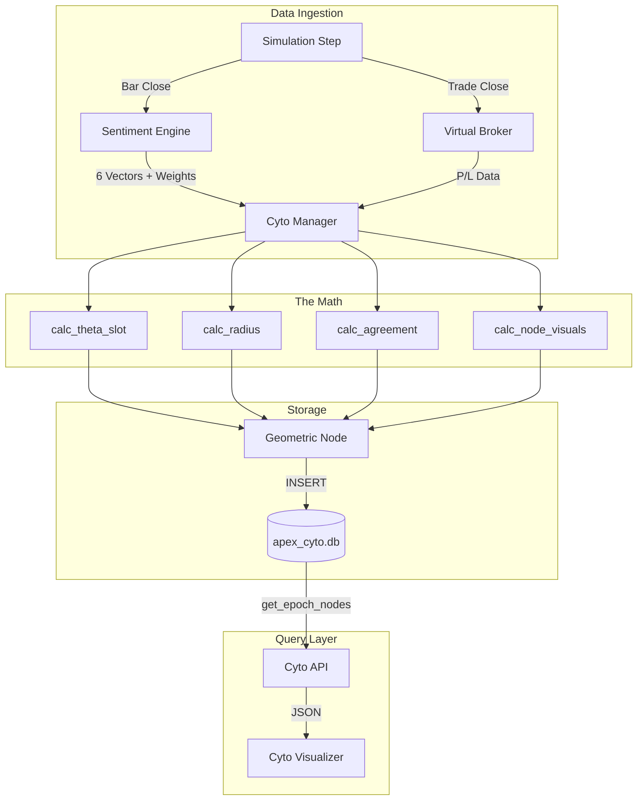

# Seed 15A – The CytoBase: Temporal & Geometric Persistence

---

**15A**: [2025-02-03] – The CytoBase Foundation ^seed-cyto-base

## Prompts & Execution
"Start with a straightforward layer that captures all data in the CytoBase based on time. 288 axes matching 15m bars in 72h epochs. Store 6 sentiment vectors, 15m weighted, 1H weighted (sticky), final weighted, and agreement score. Build both hover visualizations (radar + bars) and petal mode."

---

## 1. Seed (Intent)
- Build the **foundational SQLite database** (`apex_cyto.db`) that standardizes all simulation data into Geometric Nodes
- **The Geometry:**
  - **Time (Theta Slot):** 0-287 (1 slot = 15 minutes, 288 slots = 72 hours)
  - **Performance (Radius):** P/L Percentile mapped to 0.618 → 1.000 → 1.618
  - **Identity (Z-Layer):** Simulation Instance ID
- **The Sentiment Payload:**
  - 6 individual vectors (for radar/bar/petal visualization)
  - 15m weighted average (per bar)
  - 1H weighted average (sticky until next 1H eval)
  - Final weighted average (blend)
  - Agreement score (15m vs 1H alignment)

---

## 2. Related (Context)
- `init2.py` — The main loop / data source
- `virtual_broker.py` — Transaction source for P/L
- `sentiment_engine.py` — Source of 6 vectors and weighted averages
- [[Seed 14B – Virtual Broker]] — Instance architecture
- [[Seed 15B – Cyto Console]] — Will consume this schema
- [[Seed 15C – Lab Workbench]] — Will query for graph visualization

---

## 4. Foundation (Structure)
*Files to create:*

### Database Layer
- `database/cyto_schema.py` — Table definitions + initialization
- `database/cyto_manager.py` — CytoManager class (math + insertions + queries)

### Schema Design

**Table: `cyto_instances`**
| Column | Type | Description |
|--------|------|-------------|
| `instance_id` | TEXT PK | e.g., "USOIL_SIM_001" |
| `config_snapshot` | JSON | Exact settings used |
| `symbol` | TEXT | Trading symbol |
| `profile_name` | TEXT | AI profile that ran this |
| `created_at` | DATETIME | Instance start time |
| `status` | TEXT | "running", "completed", "failed" |

**Table: `cyto_nodes`**
| Column | Type | Description |
|--------|------|-------------|
| `node_id` | INTEGER PK | Auto-increment |
| `instance_id` | TEXT FK | Links to instance |
| `cycle_index` | INTEGER | Which 72h epoch (0, 1, 2...) |
| `theta_slot` | INTEGER | 0-287 (time position) |
| `timestamp` | DATETIME | Actual timestamp |
| **Sentiment Data** |||
| `vectors_15m` | JSON | `{"v1": 0.8, "v2": -0.3, ...}` |
| `weighted_15m` | REAL | 15m weighted average |
| `weighted_1h` | REAL | 1H weighted (sticky) |
| `weighted_final` | REAL | Final blend |
| `agreement_score` | REAL | 0-1 (how aligned 15m/1H are) |
| **Trade Data** |||
| `has_trade` | BOOLEAN | Did a trade close this bar? |
| `raw_pnl` | REAL | Raw P/L if trade closed |
| `radius` | REAL | Percentile (0.618-1.618) |
| `trade_direction` | TEXT | "long", "short", null |
| **Visualization Hints** |||
| `node_size` | REAL | Calculated from sentiment magnitude |
| `node_hue` | TEXT | "bullish", "bearish", "neutral" |
| `node_saturation` | REAL | Based on agreement score |

**Table: `cyto_trades`** (Detailed trade linkage)
| Column | Type | Description |
|--------|------|-------------|
| `trade_id` | INTEGER PK | Auto-increment |
| `node_id` | INTEGER FK | Links to the bar it closed on |
| `instance_id` | TEXT FK | Links to instance |
| `entry_time` | DATETIME | When trade opened |
| `exit_time` | DATETIME | When trade closed |
| `entry_price` | REAL | Entry price |
| `exit_price` | REAL | Exit price |
| `lots` | REAL | Position size |
| `pnl_raw` | REAL | Actual P/L |
| `pnl_normalized` | REAL | Normalized to 1 lot |

---

## 8. Infinity (Patterns)

### The 288 Clock
```
Cycle = 72 Hours = 4320 Minutes
288 Slots = 4320 / 15 = 288
1 Slot = 15 Minutes = 1 Bar
UI Rotation = Slot × 1.25°
```

### Percentile → Radius Mapping
```
Bottom 10% → 0.618 (inner ring)
50th %ile  → 1.000 (median ring)  
Top 10%    → 1.618 (outer ring)

Formula: radius = 0.618 + (percentile / 100) * (1.618 - 0.618)
Simplified: radius = 0.618 + (percentile * 0.01)
```

### Agreement Score Calculation
```python
# How aligned are 15m and 1H signals?
# Both positive or both negative = high agreement
# Opposite signs = low agreement

def calc_agreement(w_15m, w_1h):
    # Same direction bonus
    same_direction = (w_15m >= 0) == (w_1h >= 0)
    
    # Magnitude similarity (0-1)
    mag_diff = abs(abs(w_15m) - abs(w_1h))
    mag_similarity = max(0, 1 - mag_diff)
    
    if same_direction:
        return 0.5 + (mag_similarity * 0.5)  # 0.5 to 1.0
    else:
        return mag_similarity * 0.5  # 0.0 to 0.5
```

### Node Visual Encoding
| Property | Data Source | Range |
|----------|-------------|-------|
| **Position (Radius)** | P/L Percentile | 0.618 - 1.618 |
| **Position (Theta)** | Time Slot | 0° - 360° (slot × 1.25°) |
| **Size** | `abs(weighted_final)` | 4px - 16px |
| **Hue** | `weighted_final` sign | Teal (bull) / Coral (bear) / Grey (neutral) |
| **Saturation** | `agreement_score` | Muted (low) → Vivid (high) |
| **Glow** | `has_trade` | Glow if true |
| **Border Ring** | `weighted_1h` | Shows sticky hourly bias |

### Petal Mode Encoding
```
6 Petals = 6 Vectors
Petal Length = abs(vector value) × max_petal_length
Petal Color = Teal (positive) / Coral (negative)
Petal Angle = (index × 60°) offset from node center
```

---

## 7. Evolution (Real-Time Log)
*Claude: Log completed milestones here as you work.*

### Phase 1: Schema ✅ COMPLETE
- [x] Create `#Cyto/cyto_schema.py` with all tables
- [x] Add CHECK constraints (theta_slot 0-287, radius 0-2)
- [x] Create indexes on (instance_id, cycle_index, theta_slot)
- [x] Tables: cyto_instances, cyto_nodes, cyto_trades, cyto_epochs

### Phase 2: Manager Core ✅ COMPLETE
- [x] Create `#Cyto/cyto_manager.py`
- [x] Implement `calc_theta_slot(timestamp)` — 288 slot math
- [x] Implement `calc_radius(pnl, history)` — percentile ranking
- [x] Implement `calc_agreement(w_15m, w_1h)` — alignment score
- [x] Implement `calc_node_visuals(weighted_final, agreement)` — size/hue/saturation

### Phase 3: CRUD Operations ✅ COMPLETE
- [x] `create_instance(config, symbol, profile)` → instance_id
- [x] `add_node(instance_id, timestamp, vectors, weights, trade_data)` → node_id
- [x] `add_trade(node_id, trade_details)` → trade_id
- [x] `get_epoch_nodes(instance_id, cycle_index)` → list of nodes
- [x] `get_nodes_with_trades()`, `get_instance_stats()`, etc.

### Phase 4: Validation ✅ COMPLETE
- [x] `__main__` test block with sample data
- [x] Verify theta calculation (18h past epoch = slot 72)
- [x] Verify radius calculation (50th percentile = 1.0)
- [x] Verify agreement score (same direction high, opposite low)

### Phase 5: Integration (PENDING)
- [ ] Hook into init2.py simulation loop
- [ ] Connect to sentiment_engine.py for vector data
- [ ] Connect to virtual_broker.py for trade data
- [ ] Test end-to-end with live simulation

---

## 5. Senses (UX/DX)

### Color Palette (Apex Aesthetic)
```css
--cyto-bg: #121212;           /* Deep matte black */
--cyto-grid: #1e1e1e;         /* Subtle grid lines */
--cyto-bullish: #00f2ea;      /* Teal/Cyan */
--cyto-bearish: #FF6B6B;      /* Coral/Warm red */
--cyto-neutral: #6B7280;      /* Muted grey */
--cyto-glow: #00ff9d;         /* Mint green (trade glow) */
--cyto-1h-ring: #45B7D1;      /* Lighter blue (hourly bias) */
```

### Shadow Depth (Neomorphic)
```css
.cyto-node {
  box-shadow: 
    4px 4px 8px #0b0b0b,
    -4px -4px 8px #252525;
}
.cyto-node.has-trade {
  box-shadow: 
    0 0 12px var(--cyto-glow),
    4px 4px 8px #0b0b0b;
}
```

### Hover States
- **Radar Mode:** Hexagonal spider chart blooms from node center
- **Bar Mode:** Horizontal 6-bar stack appears beside node
- **Transition:** 150ms ease-out scale + fade

### Petal Mode
- **Activation:** Toggle button in Cyto Controls
- **Animation:** Nodes morph from dots to flowers (200ms stagger)
- **Density:** May need to reduce node count or cluster when too dense

---

## Architecture Flow



---

## Wake-Up Prompt

```
@SEEDS/Seed 15A – CytoBase.md
@init2.py
@database/ (existing files)

We are executing Seed 15A: "The CytoBase Foundation".

OBJECTIVE: Build the geometric database that maps simulation data to a 288-slot radial grid with full sentiment payload.

PHASE 1 - SCHEMA:
1. Create 'database/cyto_schema.py':
   - Three tables: cyto_instances, cyto_nodes, cyto_trades
   - Use SQLite with proper constraints
   - Include all sentiment fields (vectors_15m, weighted_15m, weighted_1h, weighted_final, agreement_score)
   - Include visualization hints (node_size, node_hue, node_saturation)

PHASE 2 - MANAGER:
2. Create 'database/cyto_manager.py':
   - CytoManager class
   - calc_theta_slot(timestamp): ((ts - epoch).total_seconds() / 900) % 288
   - calc_radius(pnl, history): percentile to 0.618-1.618 range
   - calc_agreement(w_15m, w_1h): alignment score 0-1
   - calc_node_visuals(): size, hue, saturation from sentiment data
   - CRUD: create_instance, add_node, add_trade, get_epoch_nodes

PHASE 3 - VALIDATION:
3. Add __main__ test block:
   - Insert sample instance
   - Insert sample nodes across different slots
   - Verify math outputs
   - Query and print results

Build the memory before the brain.
```

---

*This database is the nervous system. Every node is a neuron. The petals are dendrites. The connections will come.*
