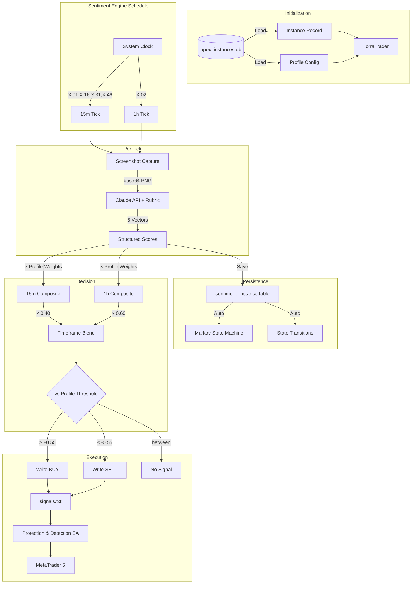

# Logic – Seed Log

---

17: 2026-02-12 – The First Run: Claude API Scoring & MT5 Trade Execution ^seed-logic-first-run

## Prompts & Execution
"I want to test the full algo first run... use my Claude API and trade/place a trade MT5 based on a weighted distribution of the JSON profile... send me an example JSON profile with weights for each and 1hr and 15m distribution... set up the py trader to execute if the score is within buy or sell range... we also need to train the API how to score each of the sentiments."

"It should analyze every 15m and then at 1hr analyze the 1hr chart not 120 sec and it should be initialized through the algo instances and associated profile that is already configured."

## 1. Seed (Intent)
- **Objective:** Build the INTEGRATED pipeline: Instance → Profile → Claude API scoring → Weighted decision → MT5 signal. Not standalone — plugs into existing instance_database, sentiment schedule, and process infrastructure.
- **Specifics:**
    - Runs per-instance, loaded from `apex_instances.db`
    - Follows sentiment_engine schedule: 15m@(X:01,X:16,X:31,X:46) + 1h@(X:02)
    - Profile weights loaded from DB `profiles` table
    - Scores saved to `sentiment_{instance_id}` tables (triggers Markov state machine)
    - Signals written to MT5 `signals.txt`

## 2. Related (Context)
- `instance_database.py` — Instance + Profile + Sentiment tables
- `sentiment_engine.py` — Schedule constants (15m/1h offsets)
- `instance_runner.py` — SIM mode runner (this is the LIVE counterpart)
- `process_manager.py` — Can spawn torra_trader as subprocess
- `config.py` — Symbol definitions
- `Protection & Detection v6.7.mq5` — EA reads signals.txt
- Seed 10/10B – The Conductor (Profile injection architecture)
- Seed 16 – Independent Instances

## 4. Foundation (Structure)
*Files:*
- **MODIFIED:** `torra_trader.py` — Live execution engine (instance-integrated)
- **MODIFIED:** `profiles/maestro_gold_v1.json` — Import template matching DB schema
- **NEW:** `scoring_rubric.py` — Claude API prompts with anchored rubrics
- **READ:** `instance_database.py` → loads instance, profile; saves sentiment
- **READ:** `config.py` → SYMBOL_DATABASES for MT5 symbol mapping
- **WRITE:** `signals.txt` → `C:\Users\colli\AppData\...\MQL5\Files\signals.txt`

## 5. Senses (UX/DX)
- Rich console output with score breakdowns, emoji indicators
- Safety: Dead zone (±0.25 = HOLD), gut check veto, cooldown, rate limiting
- All scores saved to instance sentiment tables → visible in TORRA UI
- If anything fails → HOLD. Never trade blind.

## 7. Evolution (The Shift)
- **From:** Standalone torra_trader.py with its own 120s loop and file-based profile
- **To:** Instance-integrated engine that follows the existing 15m/1h schedule, loads profile from DB, saves to instance tables, and can be spawned by process_manager

## 8. Infinity (Patterns/Debt)
- **Pattern:** The Profile (DB) is the single source of truth, not a JSON file
- **Pattern:** Schedule matches sentiment_engine — one system clock, not competing timers
- **Pattern:** Scores flow through instance tables → Markov state machine auto-updates
- **Anti-Pattern:** Never run a standalone loop that duplicates existing schedule

## Architecture Flow


## How To Run

```bash
# Set API key
set ANTHROPIC_API_KEY=sk-ant-api03-...

# Option 1: With existing instance
python torra_trader.py --instance-id xauj26_sim_abc12345

# Option 2: Auto-create instance for quick test
python torra_trader.py --symbol XAUJ26 --auto-create

# Option 3: Single analysis (no loop)
python torra_trader.py --instance-id xauj26_sim_abc12345 --once

# Option 4: Single 1h analysis
python torra_trader.py --instance-id xauj26_sim_abc12345 --once --timeframe 1h
```

## Tasks (Active Log)
- [x] Explored codebase: instance_database, sentiment_engine, instance_runner, config
- [x] Read Seed 10/10B for profile architecture
- [x] Create `profiles/maestro_gold_v1.json` (import template)
- [x] Create `scoring_rubric.py` with anchored training prompts
- [x] Create `torra_trader.py` — instance-integrated execution engine
- [x] Corrected: torra_trader now follows 15m/1h schedule, not arbitrary loop
- [x] Corrected: profile loads from DB, not standalone JSON file
- [x] Corrected: sentiment saves to instance tables, triggers Markov
- [ ] Create/attach a profile in DB for target instance
- [ ] Test: `--once` mode → screenshot → API → score → signal
- [ ] Test: `run_loop` mode → wait for schedule tick → full pipeline
- [ ] First live signal write to MT5
