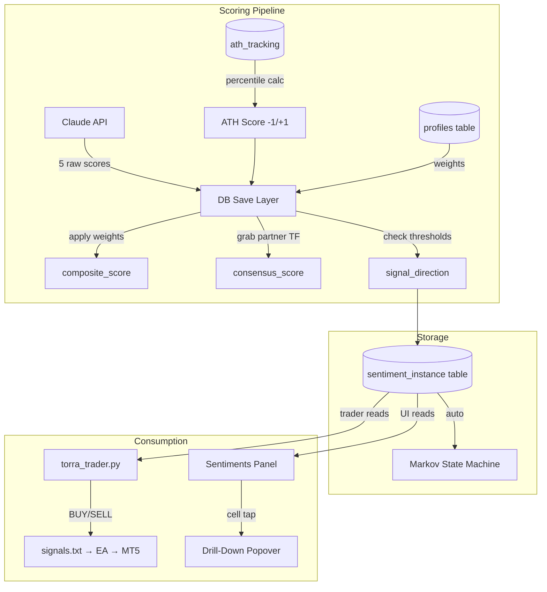

# Sentiment Architecture – Seed Log

---

18: 2026-02-13 – The Sentient Ledger: Database-Driven Scoring & Instance Sentiment Redesign ^seed-sentient-ledger

## Prompts & Execution
"We are going to rework this instance database panel so that data feeds directly into the panel from the instance when live or in simulation. Just the score not the actual sentiment. I want to remove volume and replace it with all time high. ATH score has much more meaning when making trade decisions. The py trader will have a much easier time reading from the database and seeing this meets the requirements for a trade rather than just going strictly off of the py program. So we need to integrate the profile into the database for the weights and calculate into the database before making any trade."

"I was thinking percentiles for ATH — not AI assessed — translated into -1 to +1. We'd need to add a column for percentiles into the ath_tracking table as well."

"If I click on a data cell or a title can you show more in depth information based on the current configurations like meta or background data such as the weights."

## 1. Seed (Intent)
- **The database becomes the brain.** All scoring intelligence lives in the DB — profile weights applied, cross-timeframe consensus calculated, thresholds checked — BEFORE the trader ever reads it.
- **Replace Volume with ATH** as the 5th sentiment vector. ATH percentile is calculated deterministically from `ath_tracking` data, not AI-assessed. Mapped to -1/+1 range.
- **Cell-tap drill-down UI** — clicking any score cell, composite, bias, or column header reveals contextual detail (weights used, contributions, profile config, meta) in a popover anchored to the cell.
- **The trader becomes simple:** read `consensus_score`, `meets_threshold`, `signal_direction` → execute or hold. No internal scoring logic needed.

## 2. Related (Context)
- [[Seed 17 – The First Run]] (torra_trader.py pipeline — this restructures WHERE scoring happens)
- [[Seed 16 – Independent Instances]] (per-symbol process architecture)
- [[Seed 10/10B – The Conductor]] (profile injection — weights now baked into DB)
- `instance_database.py` — Sentiment table schema lives here (MODIFY)
- `ath_tracking` table in per-symbol DBs — Source for ATH percentile calculation
- `profiles` table in `apex_instances.db` — Weights & thresholds source of truth
- [[Fruit Log 1.31.26]] — init2.py is the ONLY entry point, never flask_apex.py

## 4. Foundation (Structure)
*Files involved — expand as dependencies surface:*

### MODIFIED
- `instance_database.py` — New sentiment table schema (drop volume, add ATH, add consensus/threshold columns, add weights_snapshot)
- `torra_trader.py` — Simplify: read verdict from DB instead of internal scoring
- `scoring_rubric.py` — Update 5-vector rubric (ATH replaces Volume)
- `init2.py` — Any new API routes for cell drill-down data
- `templates/apex.html` or relevant JS — Sentiments panel UI changes (column headers, cell-tap popovers)

### NEW
- ATH percentile calculation function (in `ath_calculator.py` or `instance_database.py`)

### READ (no changes)
- `config.py` — Symbol definitions
- `profiles` table — Weights & thresholds
- `ath_tracking` table — Raw ATH data for percentile calc

## 8. Infinity (Patterns/Debt)

### Sentiment Table Schema (21 columns)
```
id                  INTEGER PK AUTO
profile_id          TEXT
symbol              TEXT
timeframe           TEXT (15m | 1h)
timestamp           TEXT

-- The 5 Vectors (raw -1.0 to +1.0)
price_action_score  REAL
key_levels_score    REAL
momentum_score      REAL
ath_score           REAL        ← NEW (replaces volume)
structure_score     REAL

-- Profile-Weighted Composite
composite_score     REAL        ← (PA×w1 + KL×w2 + MOM×w3 + ATH×w4 + STR×w5)

-- Cross-Timeframe Consensus
consensus_score     REAL        ← (composite_15m × tw_15m) + (composite_1h × tw_1h)
partner_composite   REAL        ← The other timeframe's composite used

-- Trade Decision (what the trader reads)
matrix_bias         INTEGER     ← -2 to +2
matrix_bias_label   TEXT        ← Strong Bearish → Strong Bullish
meets_threshold     INTEGER     ← 0 or 1
signal_direction    TEXT        ← BUY / SELL / HOLD

-- Reproducibility
weights_snapshot    TEXT/JSON   ← Frozen profile weights + thresholds at calc time

-- Meta
source_model        TEXT
source_type         TEXT (API | MOCK)
processing_time_ms  INTEGER
created_at          TEXT
```

### ATH Percentile Calculation
- Source: `ath_tracking.ath_distance_pct` from per-symbol intelligence DBs
- Method: Percentile rank within lookback window (e.g., last 500 bars)
- Mapping to -1/+1:
  - Near ATH (top percentile) → positive score (bullish conviction)
  - Far from ATH (bottom percentile) → negative score (bearish / recovery play)
  - Mid-range → near zero
- Add `ath_percentile` column to `ath_tracking` table for CytoBase display

### Consensus Logic
- Every new 15m reading: grab latest 1h composite → blend using timeframe weights
- Every new 1h reading: grab latest 15m composite → blend using timeframe weights
- Formula: `consensus = (own_composite × own_weight) + (partner_composite × partner_weight)`
- The 1h naturally dominates (default 60%) but 15m recalculates every tick

### Cell-Tap Drill-Down Data
- **Score cell (PA/KL/MOM/ATH/STR):** raw score, weight, weighted contribution, % of composite
- **COMP cell:** all 5 weighted contributions, profile name, weights breakdown
- **BIAS cell:** consensus calculation — both composites, timeframe weights, threshold check
- **Column header:** profile config for that category, sparkline of recent scores
- **Timestamp:** full meta — model, processing time, tokens, weights_snapshot JSON

### Anti-Patterns
- Never calculate composite in the trader — DB is the single scoring authority
- Never store individual weight columns — use `weights_snapshot` JSON per row
- Never assess ATH via API — it's deterministic from existing data

## 7. Evolution (Real-Time Log)
*Starting point: Schema design approved, ready for implementation.*
- [x] Migrate sentiment table schema in `instance_database.py` ✅ 2026-02-13
- [ ] Add `ath_percentile` column to `ath_tracking` table
- [ ] Build ATH percentile → score mapping function
- [x] Update `scoring_rubric.py` (swap Volume for ATH) ✅ 2026-02-13
- [x] Wire composite calculation into DB save layer (apply profile weights on insert) ✅ 2026-02-13
- [x] Wire consensus calculation (cross-timeframe blending on insert) ✅ 2026-02-13
- [x] Wire threshold check + signal_direction on insert ✅ 2026-02-13
- [x] Update sentiments panel UI (rename VOL → ATH column) ✅ 2026-02-13
- [x] Build cell-tap popover component ✅ 2026-02-13
- [x] Wire popover data injection per cell type ✅ 2026-02-13
- [x] Popover CSS (dark panel, teal accents, smooth fade-in) ✅ 2026-02-13
- [x] Profile dataclass default weights updated (ath replaces volume) ✅ 2026-02-13
- [x] State transition insert fixed (ath_score replaces volume_score) ✅ 2026-02-13
- [ ] Simplify `torra_trader.py` to read verdict from DB
- [ ] Test: 15m insert → consensus recalculates against latest 1h
- [ ] Test: 1h insert → consensus recalculates against latest 15m
- [ ] Test: cell-tap shows correct weight breakdown
- [x] Rewrote `apex_sentiment.js` v3.0 — polls DB for real scores instead of mock text ✅ 2026-02-13
- [x] New scored UI: composite/consensus/signal banner + 5-vector grid with weights ✅ 2026-02-13
- [x] Updated `apex_sentiment.css` v3.0 — neomorphic scored cards ✅ 2026-02-13
- [x] Wired `apex_views.js` ACTIVE button to pass instanceId to sentiment panel ✅ 2026-02-13
- [x] Added `toggleTrading()` to `apex_instances.js` — dispatches torra:activate + starts sentiment ✅ 2026-02-13
- [x] `torra_trader.py` v2.0 already wired: screenshot → API → ATH → save_sentiment → read verdict ✅
- [x] `calculate_ath_score()` exists in `ath_calculator.py` ✅
- [x] Rewired ACTIVE button to use TorraTraderBridge (not old process manager) ✅ 2026-02-13
- [x] Added `--run-now` flag to torra_trader.py for immediate first tick ✅ 2026-02-13
- [x] trader_routes.py passes `--run-now` on subprocess spawn ✅ 2026-02-13
- [x] Removed old Seed 16 process_manager calls from ACTIVE handler ✅ 2026-02-13
- [x] Fixed orb/clock profile image (image_path vs imagePath key mismatch) ✅ 2026-02-13
- [x] Removed rank number badge from orb bottom-right ✅ 2026-02-13
- [x] Synced clock profile selection with ProfileManager.setActiveProfile() ✅ 2026-02-13
- [x] Created /debug Mission Control page (trader processes, sentiments, instances, event log) ✅ 2026-02-13
- [x] Registered /debug route in init2.py ✅ 2026-02-13
- [x] Added `register_instance()` to instance_database.py — accepts pre-existing IDs from frontend ✅ 2026-02-13
- [x] Fixed /api/instance/<id>/initialize to use register_instance (was creating new IDs!) ✅ 2026-02-13
- [x] Auto-register instance in trader_routes.py validation if not in DB ✅ 2026-02-13
- [x] Bridge sends profile_id with trader start request ✅ 2026-02-13
- [x] Nuked gold rank badges from orb CSS (display: none) ✅ 2026-02-13
- [ ] Test: Start trader via double-tap → sentiment panel shows real API scores
- [ ] Test: Intelligence Database Sentiments tab populates from DB

## 5. Senses (UX/DX)

### Sentiments Panel
- Column headers: TIME | PA | KL | MOM | ATH | STR | COMP | BIAS
- ATH column replaces VOL — same position, same styling
- Scores display as compact numbers (e.g., 0.42, -0.71)
- COMP shows consensus_score (the blended value), not raw composite
- BIAS shows colored label (teal for bullish, red for bearish)

### Cell-Tap Popover
- Dark panel matching existing aesthetic (bg: #1a1a2e border: teal/purple gradient)
- Anchored to tapped cell, arrow pointing to source
- Dismiss on click-outside or Escape
- Content varies by cell type (score detail vs composite breakdown vs meta)
- Smooth fade-in, no jarring appearance
- Mobile-friendly tap targets

### Trader Console
- Simplified output: "Reading DB → consensus: 0.72 | signal: BUY | threshold: MET ✓ → Executing"
- No internal weight calculations logged — that's the DB's job now

## Architecture Flow

