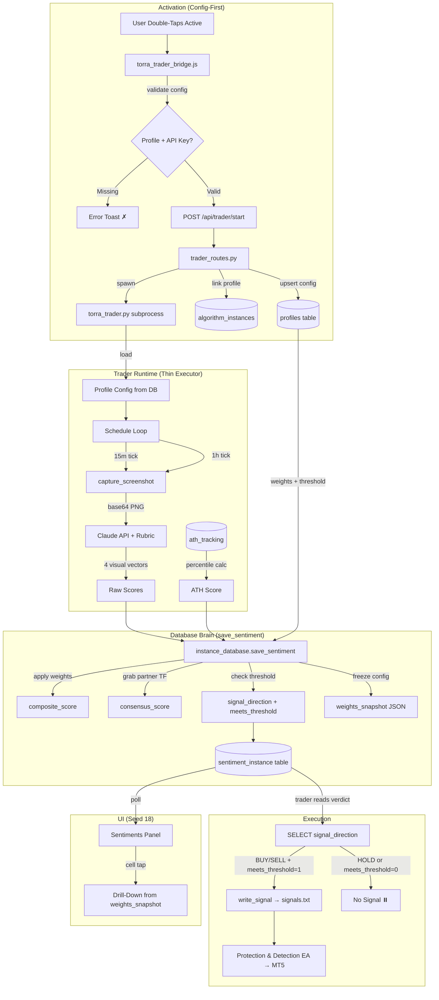

# Execution Engine – Seed Log

---

19: 2026-02-13 – The Rewired Engine: Torra Trader Full Rewrite & Config-First Activation ^seed-rewired-engine

## Prompts & Execution
"When the program is activated by double clicking the active button in the algo page. It should use the config first of all and update the instance database sentiments section. We will need a full rewrite of the torra trader program to do this right."

## 1. Seed (Intent)
- **Full rewrite of `torra_trader.py`** — the trader no longer scores, calculates, or decides. It becomes a **thin execution layer** that:
  1. Loads config from the instance's linked profile on activation
  2. Runs the Claude API pipeline (screenshot → scoring rubric → 5 raw vectors)
  3. Calculates ATH score deterministically from `ath_tracking` data (not AI-assessed)
  4. **Writes everything to the instance sentiment table** with profile weights applied, consensus blended, threshold checked — all at insert time
  5. Reads the verdict back (`meets_threshold`, `signal_direction`) and either executes or holds
- **Config-first activation flow:** Double-click Active → frontend sends full profile config → backend validates config exists & is complete → upserts to DB → THEN spawns trader. If config is incomplete (no API key, no weights), trader refuses to start with a clear error.
- **Database is the single scoring authority** — the trader never holds scoring state internally. Every decision is traceable to a sentiment row with a frozen `weights_snapshot`.

## 2. Related (Context)
- [[Seed 18 – The Sentient Ledger]] (schema redesign: ATH replaces Volume, DB-driven consensus, cell-tap drill-down — this seed IMPLEMENTS the trader side of that vision)
- [[Seed 17 – The First Run]] (current torra_trader.py — the starting point being rewritten)
- [[Seed 16 – Independent Instances]] (process isolation — activation flow stays the same, trader internals change)
- [[Seed 10/10B – The Conductor]] (profile injection — weights now baked into DB at save time)
- `instance_database.py` — Sentiment table schema (Seed 18's 21-column schema)
- `ath_calculator.py` — ATH percentile → score mapping function
- `scoring_rubric.py` — 5-vector Claude prompts (ATH replaces Volume in rubric)
- `trader_routes.py` — Backend spawn route (config validation added)
- `torra_trader_bridge.js` — Frontend activation (config-first validation added)
- `config.py` — SYMBOL_DATABASES + intelligence DB paths

## 4. Foundation (Structure)
*AI: Exact files involved, expanding as implementation progresses.*

### REWRITTEN (full replacement)
- `torra_trader.py` — From 450-line scoring engine → ~250-line thin executor

### MODIFIED
- `instance_database.py` — `save_sentiment()` gains weight-application, consensus-blending, threshold-checking logic (the brain moves HERE)
- `trader_routes.py` — Config validation gate before spawn (require API key + profile + weights)
- `torra_trader_bridge.js` — Pre-flight config checks before POST, clearer error toasts
- `scoring_rubric.py` — Swap Volume category for ATH narrative (Claude still scores 4 visual vectors; ATH is injected from DB)
- `ath_calculator.py` — Add `calculate_ath_score(symbol, lookback=500)` function returning -1.0 to +1.0

### READ (no changes)
- `config.py` — SYMBOL_DATABASES for intelligence DB paths
- `process_manager.py` — Process orchestration unchanged
- `profiles` table — Weights & thresholds (source of truth)
- `ath_tracking` table — Raw ATH data in per-symbol intelligence DBs

### Pattern: Factory + Thin Executor
- **Old:** Trader = Scorer + Calculator + Decider + Executor (monolith)
- **New:** Trader = API Caller + DB Writer + DB Reader + Executor (thin pipe)

## 5. Senses (UX/DX)

### Activation Flow (User Feel)
1. User double-clicks Active on instance in algo page
2. **Immediate validation toast:** "Checking config..." (200ms)
3. If missing API key → red toast: "Configure API key in Profile Manager first"
4. If missing profile → red toast: "Attach a profile to this instance first"
5. If config valid → teal toast: "Starting XAUJ26 trader — waiting for next 15m tick..."
6. Status dot pulses teal while running

### Console Output (DX Feel — simplified from Seed 17)
```
═══════════════════════════════════════════════════════════
  🔷 TORRA TRADER v2.0 — CONFIG-FIRST EXECUTOR
  Instance:  xauj26_sim_abc12345
  Symbol:    XAUJ26
  Profile:   Maestro Gold v1
  Model:     claude-sonnet-4-20250514
  Threshold: ±0.55
  Weights:   PA:0.30 KL:0.15 MOM:0.25 ATH:0.10 STR:0.20
  TF Blend:  15m:0.40 | 1h:0.60
═══════════════════════════════════════════════════════════
  Waiting for next scheduled tick...

──── 15m TICK @ 10:01 ────────────────────────────────────
  📸 Screenshot captured (842KB)
  🤖 Claude API → 4 visual vectors (1,247ms)
  📊 ATH score calculated: +0.62 (87th percentile)
  💾 Saved to DB with weights applied:
     consensus: +0.48 | threshold: MET ✓ | signal: BUY
  
  📖 Reading DB verdict...
  🟢 EXECUTING: BUY 1.0 XAUJ26 → signals.txt
  ✅ Signal written to MT5
```

### Error States
- API failure → save partial row with `source_type: 'API_ERROR'`, signal: HOLD
- Screenshot failure → skip tick, log warning, wait for next
- DB write failure → CRITICAL: refuse to trade, log error, alert in console
- ATH data missing → default ATH score to 0.0, note in weights_snapshot

## 7. Evolution (The Shift)
- **From:** `torra_trader.py` is a 450-line monolith that screenshots, scores, calculates weights internally, blends timeframes in memory, decides, and signals — all in one class with state scattered across `_latest_15m_scores`, `_latest_1h_scores`, etc.
- **To:** `torra_trader.py` is a ~250-line thin executor. Screenshot → API → inject ATH → hand raw scores + profile config to `instance_database.save_sentiment()` which applies weights, blends consensus, checks threshold, and writes the complete verdict. Trader reads `signal_direction` from the row it just wrote. Zero internal scoring state.

### Migration Checklist (Active Log)
- [x] Rewrite `torra_trader.py` — strip all scoring math, add ATH injection, delegate to DB ✅ (v2.0 thin executor, ~250 lines)
- [x] Enhance `instance_database.save_sentiment()` — apply weights, calculate composite, blend consensus, check threshold, freeze weights_snapshot ✅ (already implemented, Seed 18 aligned)
- [x] Add `ath_calculator.calculate_ath_score()` — percentile-based, reads from intelligence DBs ✅ (already existed with percentile mapping)
- [x] Update `scoring_rubric.py` — remove Volume category, Claude scores 4 visual vectors only (PA, KL, MOM, STR), ATH is DB-injected ✅ (already updated)
- [x] Add config validation gate in `trader_routes.py` — check profile exists, API key present, weights valid before spawn ✅ (validate_start_request() gate)
- [x] Add pre-flight validation in `torra_trader_bridge.js` — check ProfileManager.getActiveConfig() has api_key + tradingConfig before POST ✅ (preflight() method)
- [ ] Test: Activate instance with no profile → clear error toast
- [ ] Test: Activate instance with profile → trader starts, waits for tick
- [ ] Test: 15m tick fires → screenshot → API → 4 scores + ATH → DB save with all 21 columns populated
- [ ] Test: DB row has correct consensus blending against partner timeframe
- [ ] Test: Trader reads `signal_direction` from DB → writes to signals.txt
- [ ] Test: Cell-tap on new sentiment row shows weights_snapshot breakdown (Seed 18 UI)

## 8. Infinity (Patterns/Debt)

### The Rewritten Trader Pipeline (per tick)
```
1. is_scheduled_tick()?     → Check 15m or 1h schedule
2. capture_screenshot()     → base64 PNG of chart
3. score_chart()            → Claude API → 4 visual vectors (PA, KL, MOM, STR)
4. calculate_ath_score()    → Deterministic from ath_tracking data → 1 vector (ATH)
5. db.save_sentiment()      → The brain:
   a. Store 5 raw scores
   b. Load profile weights from profiles table
   c. Calculate weighted composite: Σ(score_i × weight_i)
   d. Grab partner timeframe's latest composite
   e. Blend consensus: (own × own_weight) + (partner × partner_weight)
   f. Check vs threshold → meets_threshold, signal_direction
   g. Freeze weights_snapshot JSON
   h. INSERT complete row (21 columns)
6. Read verdict:            → SELECT signal_direction, meets_threshold FROM latest row
7. Execute or hold:         → If meets_threshold=1: write_signal() to MT5
```

### What the Trader NO LONGER DOES
- ~~calculate_weighted_score()~~ → DB does this
- ~~blend_timeframes()~~ → DB does this  
- ~~make_decision()~~ → DB does this
- ~~Track _latest_15m_scores / _latest_1h_scores~~ → DB is stateless per-write
- ~~VECTOR_KEYS constant~~ → Schema defines the vectors
- ~~ProfileConfig class~~ → Profile read directly from DB in save_sentiment()

### What the Trader STILL DOES
- Schedule checking (15m/1h ticks)
- Screenshot capture
- Claude API calls (with scoring_rubric prompt)
- ATH score calculation (deterministic, no API)
- Calling db.save_sentiment() with raw scores
- Reading the DB verdict
- Writing signals to MT5
- Rate limiting / cooldown (signals per hour, 5min cooldown)
- Graceful shutdown via SIGTERM

### ATH Score Calculation Detail
```python
def calculate_ath_score(symbol: str, lookback: int = 500) -> float:
    """
    Read ath_tracking.ath_distance_pct from the symbol's intelligence DB.
    Compute percentile rank within lookback window.
    Map to -1.0 / +1.0:
      - Top 10% (near ATH)   → +0.8 to +1.0
      - Top 25%              → +0.4 to +0.8
      - Middle 50%           → -0.4 to +0.4
      - Bottom 25%           → -0.8 to -0.4
      - Bottom 10%           → -1.0 to -0.8
    """
```

### Config-First Validation Chain
```
Frontend (torra_trader_bridge.js)
  → Check ProfileManager.getActiveConfig().apiKey exists
  → Check tradingConfig has sentiment_weights, thresholds
  → If missing: show error toast, STOP

Backend (trader_routes.py)
  → Receive POST /api/trader/start
  → Validate instance_id exists in DB
  → Validate api_key is non-empty string
  → Upsert trading_config to profiles table
  → Link profile to instance
  → Spawn torra_trader.py subprocess

Trader (torra_trader.py)
  → Load instance from DB
  → Verify instance.profile_id is set
  → Load profile, verify weights are valid (sum ≈ 1.0)
  → Verify API client can be created
  → If any check fails: print clear error, exit(1)
```

### Anti-Patterns to Enforce
- **Never calculate composite in the trader** — DB `save_sentiment()` is the single authority
- **Never store scores in trader memory** — every tick writes to DB, reads verdict back
- **Never skip config validation** — if profile is incomplete, refuse to start
- **Never assess ATH via API** — it's deterministic from existing ath_tracking data
- **Never hardcode defaults in the trader** — everything comes from the profile row

### Debt Resolved ✅
- ~~Current `torra_trader.py` has `ProfileConfig` class~~ → DELETED (trader reads profile directly from DB)
- ~~Current trader has `calculate_weighted_score()`, `blend_timeframes()`, `make_decision()`~~ → Already in `save_sentiment()`
- ~~`scoring_rubric.py` still prompts for Volume~~ → Already updated (4 visual vectors only)
- ~~`torra_trader_bridge.js` `DEFAULT_TRADING_CONFIG` has `volume: 0.10`~~ → Updated to `ath: 0.10`
- ~~`trader_routes.py` doesn't validate completeness~~ → `validate_start_request()` gate added

## Architecture Flow

