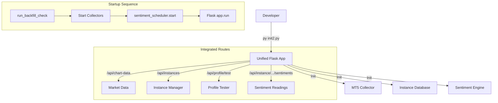

# Structure – Seed Log

---

4: 2026-01-31 – Migrate Profile & Instance Logic to init2.py (Single Entry Point) ^seed-structure-init2-migration

## Prompts & Execution
"First seed: I use py init2.py to start up the application this is the central base for all of the applications. The previous versions accidentally used flask_apex.py as the main application... We need to move everything over to init2.py."

## 1. Seed (Intent)
- **Objective:** Consolidate the application. Move "Profile Manager" and "Instance Browser" logic from the deprecated `flask_apex.py` into the master `init2.py`.
- **Outcome:** Running `py init2.py` launches the full, unified experience (Trading + Profiles + Instances).

## 2. Related (Context)
- [[Structure – Fruit Log#^fruit-entry-point]] (The directive to use init2.py)
- `flask_apex.py` (The source to be drained and deprecated)

## 4. Foundation (Structure)
*Files involved:*
- **Source (DRAIN):** `flask_apex.py`
  - `from instance_database import get_instance_db, AlgorithmInstance`
  - `from dataclasses import asdict`
  - `from sentiment_engine import SentimentConfig, SentimentScheduler, SentimentDatabase, register_sentiment_routes`
  - Instance DB init: `instance_db = get_instance_db(...)`
  - Sentiment init: `SentimentScheduler`, `register_sentiment_routes(app, ...)`
  - Routes to extract:
    - `/api/instances` (GET, POST)
    - `/api/instances/<instance_id>` (GET)
    - `/api/instances/<instance_id>/archive` (POST)
    - `/api/instances/<instance_id>/restore` (POST)
    - `/api/instance/<instance_id>/initialize` (POST)
    - `/api/instance/<instance_id>/positions` (GET)
    - `/api/instance/<instance_id>/sentiments` (GET)
    - `/api/instance/<instance_id>/transitions` (GET)
    - `/api/instance/<instance_id>/matrices` (GET)
    - `/api/profile/test` (POST)
- **Target (FILL):** `init2.py`
  - Add imports after line ~15
  - Add instance_db + sentiment init after line ~35 (after CORS)
  - Add routes after line ~400 (before STARTUP section)
- **Support Files (READ ONLY):**
  - `instance_database.py` — InstanceDatabase class
  - `sentiment_engine.py` — SentimentScheduler, register_sentiment_routes

## 5. Senses (UX/DX)
- **Fluidity:** Developer confidence — one entry point (`py init2.py`).
- **Reliability:** No port conflicts, no dual Flask instances.
- **Startup:** Sentiment scheduler starts in `startup()` function.

## 7. Evolution (Real-Time Log)
*Claude: Log completed milestones here as you work.*
- [x] Scanned Fruit Log — confirmed single entry point rule
- [x] Read flask_apex.py — identified 10 instance routes + 1 profile route
- [x] Read init2.py — confirmed no instance/sentiment logic present
- [x] Grew Lens 4 with exact file paths and route list
- [x] Migrate imports to init2.py (dataclasses.asdict)
- [x] Migrate instance_db initialization (lines 54-66)
- [x] Migrate sentiment engine initialization (lines 68-95)
- [x] Migrate all /api/instances/* routes (10 routes, lines 761-909)
- [x] Migrate /api/profile/test route (lines 914-966)
- [x] Wire sentiment_scheduler.start() into startup()
- [x] Wire sentiment_scheduler.stop() into shutdown()
- [ ] Test: `py init2.py` launches with all features
- [ ] Deprecate flask_apex.py (rename to flask_apex.py.DEPRECATED)

## 8. Infinity (Patterns)
- **Single Entry Point:** *One App, One Launch Command.*
- **Graceful Init:** Wrap imports in try/except for missing dependencies.

## Architecture Flow

