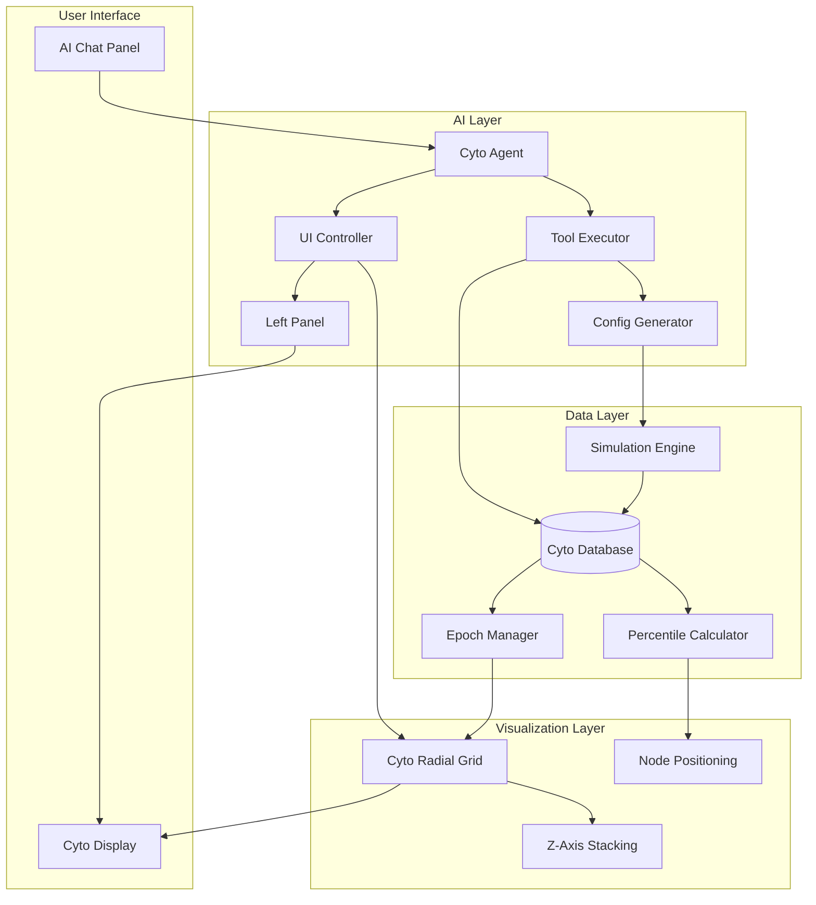

# Seed 15: Cyto Intelligence Layer – Seed Log

---

**15A**: [2025-02-03] – The Cyto Intelligence Layer ^seed-cyto-intelligence

## Prompts & Execution
"Cyto becomes the instance database with radial epoch visualization, percentile-based node placement, Z-axis instance stacking, and a fine-tuned AI API that can query, analyze, compare scenarios, generate new configs, and spawn A/B test simulations autonomously."

---

## 1. Seed (Intent)
- Transform Cyto from a static visualization into the **central intelligence database** for all simulation instances
- Enable **parallel replay comparison** — same historical data, multiple configs, visual diff on results
- Integrate a **fine-tuned AI agent** that can read the database, control the UI, analyze patterns, and autonomously generate new config versions for testing

---

## 2. Related (Context)
- [[Seed 14B – Virtual Broker Implementation]] — Instance architecture that Cyto will visualize
- [[Seed 10D – Dual Timeframe Sentiment]] — Data feeds that populate the nodes
- [[Profile Controller / Orb Interface]] — Profile management that Cyto instances map to
- **New Dependency:** Fine-tuned model training pipeline for Apex-specific API
- **Design System:** Neomorphic + blue/gold + matte black shadows (current Apex aesthetic)

---

## 4. Foundation (Structure)
*AI/Claude: List ACTUAL files involved. Add to this list as you discover dependencies.*

### Frontend (Cyto Visualization)
- `src/components/cyto/CytoRadial.tsx` — Main radial epoch grid component
- `src/components/cyto/CytoNode.tsx` — Individual trade signal node
- `src/components/cyto/CytoRings.tsx` — Percentile ring bands (0.618 → 1.000 → 1.618)
- `src/components/cyto/CytoZStack.tsx` — Z-axis instance layer management
- `src/components/cyto/CytoControls.tsx` — Epoch navigation, layer toggles, variable selectors
- `src/styles/cyto.css` — Neomorphic styling, blue glow, matte shadows

### Backend (Instance Database)
- `src/database/cyto_schema.py` — SQLite/PostgreSQL schema for instance data
- `src/database/cyto_queries.py` — Query builders for filtering, aggregation, comparison
- `src/database/epoch_manager.py` — 72-hour epoch windowing logic
- `src/database/percentile_calculator.py` — P/L normalization to 1-lot, percentile ranking

### AI Integration Layer
- `src/api/cyto_agent.py` — Fine-tuned model interface for Cyto commands
- `src/api/cyto_tools.py` — Tool definitions (filter_view, compare_instances, generate_config, spawn_sim)
- `src/api/cyto_prompts.py` — System prompts and few-shot examples for Apex context
- `src/api/config_generator.py` — Automated JSON config creation with version tracking

### Data Models
- `src/models/cyto_node.py` — Node schema (time, percentile, config_id, epoch, linked_data)
- `src/models/cyto_instance.py` — Instance schema (config_version, parent_config, sim_id, z_index)
- `src/models/cyto_epoch.py` — Epoch schema (start_time, end_time, x_resolution)

---

## 8. Infinity (Patterns/Debt)

### Patterns to Enforce
- **Fibonacci Percentile Bands:** 0.618 (floor) → 1.000 (median) → 1.618 (ceiling) — sacred geometry in the UI
- **Epoch as Universal Time Unit:** All queries, comparisons, and visualizations anchor to 72h epochs
- **Node Linkage:** Every node is a portal — click to access full trade data, config, signals, and sentiment state
- **Instance Immutability:** Once a sim runs, its data is frozen. New tests = new instances, never overwrites
- **AI Tool Pattern:** Agent uses structured tool calls, never raw code injection

### Debt to Avoid
- ❌ Hardcoding epoch duration — make configurable (72h default)
- ❌ Coupling visualization to specific data source — abstract through query layer
- ❌ AI agent with direct database write access — all mutations through validated config generator
- ❌ Z-axis without clear visual hierarchy — enforce color/opacity rules for layer stacking

---

## 7. Evolution (Real-Time Log)
*Claude: Log completed milestones here as you work.*

### Phase 1: Database Schema & Backend
- [ ] Design cyto_schema.py with epoch, node, instance tables
- [ ] Implement percentile_calculator.py (1-lot normalization)
- [ ] Build epoch_manager.py (72h windowing, 360/720 resolution toggle)
- [ ] Create cyto_queries.py (filter by epoch, config, percentile range)

### Phase 2: Radial Visualization
- [ ] Build CytoRadial.tsx with configurable ring count
- [ ] Implement CytoNode.tsx with percentile-based positioning
- [ ] Add CytoRings.tsx with Fibonacci band markers
- [ ] Style with neomorphic blue/gold/matte black theme

### Phase 3: Z-Axis Instance Stacking
- [ ] Implement CytoZStack.tsx for layer management
- [ ] Add color gradient system based on selectable variable
- [ ] Build layer toggle controls in CytoControls.tsx
- [ ] Ensure visual clarity with transparency/depth cues

### Phase 4: AI Agent Integration
- [ ] Define tool schemas in cyto_tools.py
- [ ] Build cyto_agent.py with fine-tuned model connection
- [ ] Implement config_generator.py with version tracking
- [ ] Create spawn_sim integration with virtual broker

### Phase 5: Left Panel Dynamic Views
- [ ] Connect node selection to left panel data display
- [ ] Enable AI-controlled panel switching (positions, configs, matrices, JSON editor)
- [ ] Build bulk edit interface for config parameters
- [ ] Add A/B test notes and lineage tracking

---

## 5. Senses (UX/DX)

### Visual Design
- **Radial Grid:** Subtle blue glow on rings, gold accent on 1.000 median line
- **Nodes:** Small orbs with color intensity based on P/L magnitude, hover reveals tooltip
- **Z-Stack:** Translucent layers, front instance fully opaque, rear instances fade (0.7 → 0.4 opacity)
- **Neomorphic Depth:** Matte black shadows on all panels, soft inner glow on interactive elements

### Interaction Design
- **Click Node:** Populate left panel with linked trade data
- **Hover Layer:** Highlight all nodes from that instance
- **AI Chat:** Bottom panel accepts natural language, streams responses, shows tool calls in progress
- **Epoch Navigation:** Scroll wheel or arrow keys to move through epochs

### Performance
- **Lazy Loading:** Only render visible epoch + 1 buffer on each side
- **Node Clustering:** Aggregate dense regions at zoom-out, expand on zoom-in
- **WebGL Option:** If >1000 nodes per epoch, switch to GPU-accelerated rendering

---

## Architecture Flow


---

## Config Schema (Draft)
```json
{
  "cyto_config": {
    "epoch_duration_hours": 72,
    "x_resolution": 360,
    "percentile_bands": {
      "floor": 0.618,
      "median": 1.000,
      "ceiling": 1.618
    },
    "ring_count": 9,
    "z_max_layers": 10,
    "color_variable": "pnl_normalized",
    "color_scheme": {
      "negative": "#FF6B6B",
      "neutral": "#4ECDC4",
      "positive": "#45B7D1"
    }
  }
}
```

---

## Open Questions
1. **Fine-tuning dataset:** Do we have enough Apex interaction logs to train, or start with few-shot prompting?
2. **Database choice:** SQLite for local, PostgreSQL for scale — or start with SQLite and migrate?
3. **WebSocket vs Polling:** For live sim updates to Cyto, which pattern?
4. **Config version naming:** Semantic (v2.1.0) or timestamp-based (20250203_1205)?

---

*This seed plants the foundation for Apex to become self-improving. Cyto is the eye. The AI is the brain. The simulation engine is the body. Together, they learn.*
