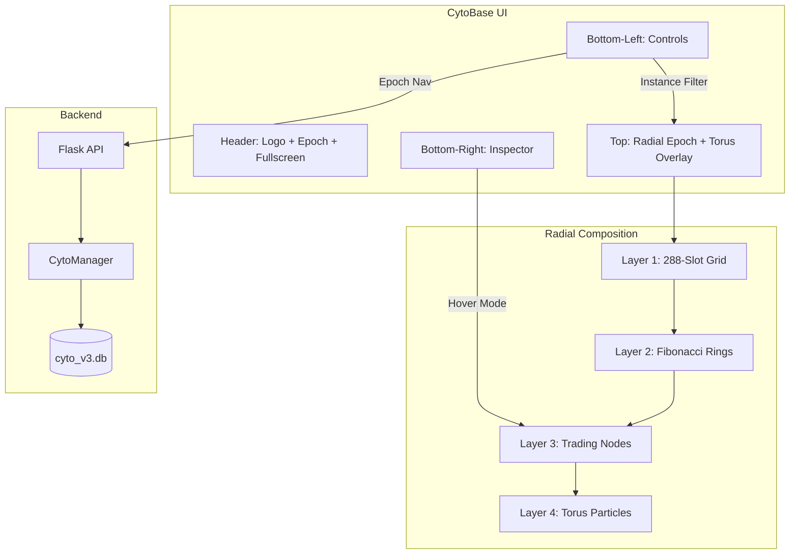

# Seed 15BC – The Cyto Intelligence Console (Unified)

---

**15BC**: [2025-02-03] – The Cyto Intelligence Console: Radial Visualization + Lab Workbench ^seed-cyto-console

## Prompts & Execution
"The CytoBase will replace the metatron Radial Database from the menu and become an instance type in the apex application... don't get rid of the torus engine graphics just because they look amazing... torus particles visualized from overhead angle and placed over the current epoch... adjust the width of dimensions... recycle the bottom matte grey half (control center base) of the current metatron radial database and just rename it to CytoBase... above with the teal blue dot you can put RADIAL DATABASE... each database quadrant should be able to be made full screen for easier manual inspection and selection."

---

## 1. Seed (Intent)

Transform **Metatron Radial Database** into **CytoBase Intelligence Console**:
1. **Replace naming:** Metatron → CytoBase throughout
2. **Preserve torus particles:** Flatten to overhead view, overlay on 288-slot epoch grid
3. **Recycle control panel:** Keep existing matte grey bottom structure, adapt contents
4. **Add fullscreen mode:** Each quadrant can expand to full view

**The Vision:** Trading nodes orbit within a plasma containment field. The torus particles become ambient energy flowing through time. The radial epoch is the structure. The particles are the life.

---

## 2. Related (Context)

### Source Files (To Modify/Replace)
- `templates/metatron_radial.html` — Current UI (will become `cytobase.html`)
- `templates/metatron_radial_vertical.html` — Vertical variant (reference)
- `static/img/metatron_torus_v5.png` — Static fallback

### New Dependencies
- `#Cyto/cyto_schema.py` — ✅ EXISTS - Database schema
- `#Cyto/cyto_manager.py` — ✅ EXISTS - CytoManager class

### Design Language Preserved
- Torus Engine (Three.js particles)
- Neumorphic matte grey cards
- Golden/Teal/Magenta plasma spectrum
- JetBrains Mono + Orbitron fonts

### Design Language Added
- `--apex-teal: #00f2ea` — Data nodes (bullish)
- `--apex-coral: #FF6B6B` — Loss nodes (bearish)
- `--apex-mint: #00ff9d` — Trade glow
- Fibonacci rings: 0.618 / 1.000 / 1.618

---

## 4. Foundation (Structure)

### File Changes

```
#CodeBase/
├── templates/
│   ├── metatron_radial.html      # RENAME → cytobase.html
│   └── metatron_radial_vertical.html  # KEEP for reference
├── static/
│   ├── css/
│   │   └── cytobase.css          # NEW - Extracted styles + Apex additions
│   └── js/
│       ├── cytobase_radial.js    # NEW - 288-slot epoch renderer
│       ├── cytobase_torus.js     # EXTRACT - Torus engine (overhead mode)
│       └── cytobase_controls.js  # NEW - Bottom panel logic
```

### Layout Structure (4 Quadrants)

```
┌─────────────────────────────────────────────────────────────────────┐
│  HEADER: ● CYTOBASE | RADIAL DATABASE | Epoch: 47 | [⛶ Fullscreen] │
├─────────────────────────────────────────────────────────────────────┤
│                                                                     │
│                    TOP HALF: RADIAL EPOCH VIEW                      │
│                                                                     │
│         ┌─────────────────────────────────────────────┐            │
│         │                                              │            │
│         │      288-SLOT RADIAL GRID (Canvas)          │            │
│         │      + Torus Particles Overhead Layer        │            │
│         │      + Trading Nodes (size/hue/glow)        │            │
│         │      + Fibonacci Rings (0.618, 1.0, 1.618)  │            │
│         │                                              │            │
│         └─────────────────────────────────────────────┘            │
│                                                                     │
├────────────────────────────┬────────────────────────────────────────┤
│                            │                                        │
│  Q3: CONTROL PANEL LEFT    │  Q4: CONTROL PANEL RIGHT              │
│  (Matte Grey Base)         │  (Matte Grey Base)                    │
│                            │                                        │
│  • Epoch Navigation        │  • Node Inspector                     │
│    [< Prev] [Live] [Next >]│    - Selected node details            │
│                            │    - 6-vector radar chart             │
│  • Instance Selector       │    - Trade P/L if applicable          │
│    [Dropdown: All / SIM_1] │                                        │
│                            │  • Hover Mode Toggle                  │
│  • Layer Toggles           │    [Radar] [Bars] [Petals]            │
│    [✓] SIM_001             │                                        │
│    [✓] SIM_002             │  • Quick Stats                        │
│    [ ] SIM_003 (hidden)    │    Trades: 47 | Win: 62% | P/L: +$340 │
│                            │                                        │
└────────────────────────────┴────────────────────────────────────────┘
```

### Fullscreen Mode

Each section can expand:
- **Top (Radial):** Click header → fills entire viewport
- **Q3 (Controls):** Click header → expands to full bottom half
- **Q4 (Inspector):** Click header → expands to full bottom half

```javascript
// Fullscreen toggle pattern
function toggleFullscreen(section) {
    const el = document.querySelector(`#${section}`);
    el.classList.toggle('fullscreen');
    // CSS handles: position: fixed; inset: 0; z-index: 1000;
}
```

---

## 8. Infinity (Patterns/Logic)

### Pattern 1: The Overhead Torus

Current torus is viewed at 45° angle. For epoch overlay:
1. Flatten camera to top-down (Y-axis looking down)
2. Reduce torus minor radius (thinner ring)
3. Particles flow in a circle matching the 288-slot perimeter
4. Particles become "energy" flowing through time slots

```javascript
// Camera change
camera.position.set(0, 12, 0);  // Directly above
camera.lookAt(0, 0, 0);

// Torus adjustment  
const torusGeometry = new THREE.TorusGeometry(
    3.5,    // Major radius (matches epoch grid)
    0.3,    // Minor radius (thinner)
    32,     // Tube segments
    288     // Radial segments (matches slots!)
);
torus.rotation.x = 0;  // Flat
```

### Pattern 2: The 288 Clock

Time mapping remains:
```
1 Slot = 15 minutes
288 Slots = 72 hours
Angle = Slot × 1.25°
```

Nodes positioned by:
- **Theta (angle):** Time slot position
- **Radius:** P/L percentile (0.618 inner losers → 1.618 outer winners)

### Pattern 3: Node Visual Encoding

| Property | Data | Visual |
|----------|------|--------|
| Position (θ) | Time slot | Angle on circle |
| Position (r) | P/L percentile | Distance from center |
| Size | `abs(weighted_final)` | 4px - 16px |
| Hue | Sentiment direction | Teal (bull) / Coral (bear) |
| Saturation | Agreement score | Muted → Vivid |
| Glow | Has trade | Mint ring if true |

### Pattern 4: Petal Mode (Future)

When toggled, nodes morph into 6-petal flowers:
- Each petal = 1 sentiment vector
- Petal length = magnitude
- Petal color = direction

### Pattern 5: Control Panel Inheritance

The bottom half structure from Metatron is preserved:
- Same matte grey background (`--void-tertiary`)
- Same border treatment (`rgba(255,255,255,0.04)`)
- Same padding/spacing
- Different contents (trading controls vs dev zones)

---

## 7. Evolution (Real-Time Log)

### Phase 1: Rename & Extract ✅ PLANNING
- [ ] Copy `metatron_radial.html` → `cytobase.html`
- [ ] Find/replace "METATRON" → "CYTOBASE"
- [ ] Find/replace "Radial Time-Capsule Database" → "Radial Trading Database"
- [ ] Update header: teal dot + "RADIAL DATABASE" label
- [ ] Extract CSS to `static/css/cytobase.css`
- [ ] Extract Torus Engine to `static/js/cytobase_torus.js`

### Phase 2: Torus Overhead Mode
- [ ] Modify camera position (top-down)
- [ ] Adjust torus geometry (flatter, matches grid radius)
- [ ] Update particle flow (circular, not helical)
- [ ] Blend torus as overlay layer (composite on top of grid)

### Phase 3: Radial Epoch Grid
- [ ] Create `static/js/cytobase_radial.js`
- [ ] Draw 288-slot grid (concentric rings + radial lines)
- [ ] Draw Fibonacci rings (0.618, 1.000, 1.618)
- [ ] Add time labels (every 3 hours = 12 slots)
- [ ] Implement node rendering (position, size, color, glow)

### Phase 4: Bottom Control Panel
- [ ] Adapt left panel: Epoch nav, instance selector, layer toggles
- [ ] Adapt right panel: Node inspector, hover mode toggle, stats
- [ ] Wire Socket.IO for real-time updates
- [ ] Add fullscreen toggle to each section header

### Phase 5: Integration
- [ ] Connect to CytoManager API
- [ ] Load real epoch data
- [ ] Test instance filtering
- [ ] Test epoch navigation

---

## 5. Senses (UX/DX)

### Preserved Aesthetics (from Metatron)
```css
:root {
    /* Void backgrounds */
    --void-core: #020304;
    --void-secondary: #080a0e;
    --void-tertiary: #0d1015;
    --void-elevated: #12161c;
    --void-surface: #181c24;
    
    /* Plasma spectrum */
    --plasma-gold: #D4AF37;
    --plasma-teal: #20B2AA;
    --plasma-magenta: #C084FC;
    --plasma-mint: #ADEBB3;
    
    /* Glow effects */
    --glow-gold: 0 0 20px rgba(212, 175, 55, 0.4);
    --glow-teal: 0 0 15px rgba(32, 178, 170, 0.3);
}
```

### New Additions (for Trading)
```css
:root {
    /* Trading node colors */
    --node-bullish: #00f2ea;      /* Bright teal */
    --node-bearish: #FF6B6B;      /* Coral */
    --node-neutral: #6B7280;      /* Grey */
    --node-trade-glow: #00ff9d;   /* Mint */
    
    /* Fibonacci rings */
    --ring-inner: rgba(255, 107, 107, 0.2);   /* 0.618 - losers */
    --ring-median: rgba(212, 175, 55, 0.4);   /* 1.000 - median */
    --ring-outer: rgba(0, 242, 234, 0.2);     /* 1.618 - winners */
}
```

### Fullscreen Mode
```css
.section.fullscreen {
    position: fixed;
    inset: 0;
    z-index: 1000;
    background: var(--void-core);
    border-radius: 0;
}

.section.fullscreen .section-header {
    border-bottom: 1px solid rgba(212, 175, 55, 0.2);
}

.fullscreen-toggle {
    cursor: pointer;
    opacity: 0.5;
    transition: opacity 0.2s;
}
.fullscreen-toggle:hover {
    opacity: 1;
}
```

### Control Panel Cards (Recycled)
```css
.control-card {
    background: linear-gradient(145deg, var(--void-tertiary), var(--void-secondary));
    border: 1px solid rgba(255, 255, 255, 0.04);
    border-radius: 10px;
    padding: 14px 16px;
    margin-bottom: 10px;
}

.control-card:hover {
    border-color: rgba(255, 255, 255, 0.08);
    transform: translateY(-1px);
}
```

---

## Architecture Flow



---

## Wake-Up Prompt (Phase 1: Rename & Extract)

```
@SEEDS/Seed 15BC – Cyto Intelligence Console.md
@templates/metatron_radial.html

We are executing Seed 15BC Phase 1: "Rename & Extract".

OBJECTIVE: Transform Metatron into CytoBase while preserving the torus engine.

INSTRUCTIONS:
1. Copy `templates/metatron_radial.html` → `templates/cytobase.html`

2. In the new file, find/replace:
   - "METATRON" → "CYTOBASE" (all caps instances)
   - "Metatron" → "CytoBase" (title case)
   - "Radial Time-Capsule Database" → "Radial Trading Database"
   - Update title tag

3. Modify the header:
   - Change icon color from magenta to teal (`--plasma-teal`)
   - Add text "RADIAL DATABASE" next to the teal dot
   - Keep the W badge but change label to "Epoch: Live"

4. Keep EVERYTHING else intact:
   - Torus Engine (we'll modify camera angle in Phase 2)
   - Bottom control panel structure
   - All CSS variables and styles
   - React component structure

5. Test that it loads and torus still animates.

This is pure renaming. No logic changes yet.
```

---

## Execution Strategy

| Phase | Focus | Deliverable | Status |
|-------|-------|-------------|--------|
| **1** | Rename & Extract | `cytobase.html` with new branding | ⚠️ INCOMPLETE - wrong structure |
| **2** | Torus Overhead | Camera flattened, particles circular | PENDING |
| **3** | Radial Grid | 288-slot grid with Fibonacci rings | PENDING |
| **4** | Node Rendering | Trading nodes with visual encoding | PENDING |
| **5** | Control Panel | Epoch nav, instance filter, layer toggles | PENDING |
| **6** | Inspector | Radar chart, bar chart, trade details | PENDING |
| **7** | Fullscreen | Each section expandable | ✅ COMPLETE |
| **8** | Integration | Real data from CytoManager | PENDING |

---

## ⚠️ Status: Pivoted to Seed 15BD

Phase 1 was executed but the resulting `cytobase.html` had incorrect demo data (SYNC/INTEGRATION nodes from metatron instead of the 288-slot radial structure). 

**New approach:** Seed 15BD focuses on **structure only** - building the correct visual scaffold without any data, then connecting data flow in a later seed.

See: `Seed 15BD – CytoBase UI Structure.md`

---

*The plasma flows through time. Each particle is a moment. Each node is a decision. The torus contains them all.*
