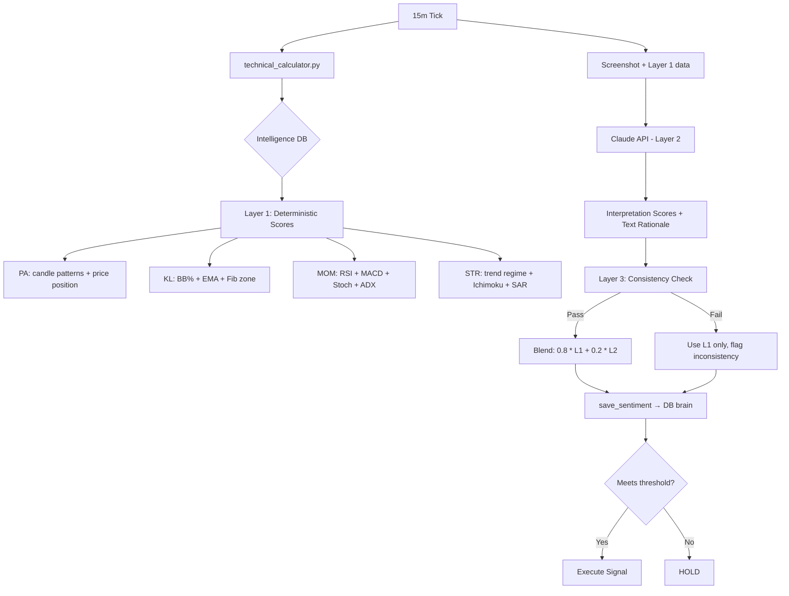

# Seed 21 – Three-Layer Scoring Engine – Seed Log

---

S21: 2026-02-13 – Deterministic Scoring Engine ^seed-three-layer-scoring

## 1. Seed (Intent)
- Replace pure-vision scoring (non-deterministic) with a **three-layer architecture**:
  - **Layer 1 (Deterministic):** Technical indicators from intelligence DB → fixed scores (80% weight)
  - **Layer 2 (Interpretive):** Claude API interprets indicators + chart screenshot → adjustment score (20% weight)
  - **Layer 3 (Validation):** Claude's text rationale checked for consistency against its numeric output

## 2. Related (Context)
- Intelligence DB: `XAUJ26_intelligence.db` — 100K+ rows with RSI, MACD, BB, Stoch, ADX, Ichimoku, Fib, ATR, ATH
- Existing: `scoring_rubric.py` — current pure-vision prompt (being replaced)
- Existing: `ath_calculator.py` — already deterministic, stays as-is
- Existing: `torra_trader.py` — thin executor, pipes data through
- Existing: `instance_database.py` → `save_sentiment()` — the DB brain that applies weights
- Config: `config.py` → SYMBOL_DATABASES defines db_path per symbol

## 4. Foundation (Structure)
*Files involved:*
- `technical_calculator.py` — **NEW** — Reads intelligence DB, computes 4 deterministic vector scores
- `scoring_rubric.py` — **MODIFY** — New prompt: give Claude indicators + screenshot, ask for interpretation
- `torra_trader.py` — **MODIFY** — Inject Layer 1 scores, blend with Layer 2 Claude interpretation
- `instance_database.py` — **UNCHANGED** — save_sentiment() already handles the math
- `config.py` — **UNCHANGED** — SYMBOL_DATABASES provides db_path
- `ath_calculator.py` — **UNCHANGED** — Already deterministic

**Pattern:** Deterministic Base + LLM Interpretation + Text Validation

## 5. Senses (UX/DX)
- **Consistency:** Same market state → same score. Every time. No more ±0.5 swings on a closed market.
- **Transparency:** Each score shows its indicator breakdown in logs
- **Fallback:** If intelligence DB is stale (>30min), flag it but still produce scores from last data
- **Speed:** Technical calc should be <50ms (pure SQL + math, no API call)

## 7. Evolution (The Shift)
- **From:** 100% Claude vision guessing → scores swing wildly on identical charts
- **To:** 80% deterministic math + 20% Claude interpretation → stable base with intelligent overlay
- **Key Insight:** Claude is excellent at synthesis and pattern recognition, terrible at precise numeric assessment of visual data

## 8. Infinity (Patterns/Debt)
- **Enforce:** All indicator normalizations map to [-1.0, +1.0] using sigmoid/tanh curves
- **Enforce:** Layer 1 scores are reproducible — same DB row → same output, always
- **Avoid:** Overfitting normalization curves to current market conditions
- **Avoid:** Making Layer 2 too influential — it's a 20% adjustment, not a co-equal
- **Debt:** Eventually add backtesting to optimize normalization parameters

## Architecture Flow


## Layer 1 Normalization Design

### Price Action (from core_15m + basic_15m)
| Indicator | Bullish | Bearish | Normalization |
|-----------|---------|---------|---------------|
| Last 3 candle direction | 3 green | 3 red | count/3 |
| Body vs wick ratio | Large bodies | Doji/wicks | tanh(body_pct - 0.5) |
| EMA distance | Price > EMA | Price < EMA | tanh(ema_distance * 10) |
| Supertrend | UP | DOWN | +0.3 / -0.3 |

### Key Levels (from advanced_indicators + fibonacci)
| Indicator | Bullish | Bearish | Normalization |
|-----------|---------|---------|---------------|
| BB %B | >0.8 (near upper) | <0.2 (near lower) | (bb_pct - 0.5) * 2, clamped |
| Fib golden zone | In zone, bouncing | In zone, breaking | zone_multiplier signal |
| SAR trend | UP | DOWN | +0.25 / -0.25 |
| Price vs Ichimoku cloud | Above | Below | ±0.3 |

### Momentum (from advanced_indicators)
| Indicator | Bullish | Bearish | Normalization |
|-----------|---------|---------|---------------|
| RSI(14) | >50, rising | <50, falling | (rsi - 50) / 50, tanh scaled |
| MACD histogram | Expanding green | Expanding red | tanh(histogram / atr) |
| Stochastic K>D | Bullish cross | Bearish cross | (K - D) / 100 |
| ADX + direction | >25 + bullish | >25 + bearish | directional score |
| CCI(14) | >100 | <-100 | tanh(cci / 200) |

### Structure (from advanced_indicators + basic_15m)
| Indicator | Bullish | Bearish | Normalization |
|-----------|---------|---------|---------------|
| ADX trend strength | Strong trend up | Strong trend down | adx_direction_score |
| Ichimoku TK cross | Tenkan > Kijun | Tenkan < Kijun | ±0.3 |
| EMA alignment | Short > Medium | Short < Medium | ±0.25 |
| SAR consistency | 3+ bars same | Mixed | persistence bonus |

## Tasks (Active Log)
- [x] Seed planted
- [x] Build `technical_calculator.py` — Layer 1 (tested against real XAUJ26 data)
- [x] Update `scoring_rubric.py` — Layer 2 interpretive prompt (+ backward compat legacy mode)
- [x] Update `apex_sentiment.css` — Neomorphic redesign with mint/teal palette
- [x] Update `torra_trader.py` v3.0 — full three-layer pipeline in _tick()
- [x] Add `score_chart_interpretive()` — Layer 2 API function
- [x] Add `validate_layer2()` — Layer 3 consistency checker (text sentiment words vs numeric direction)
- [x] Blend math verified: L1 base preserved, L2 adjusts ±0.06 max
- [x] Syntax checked all 3 files ✓
- [ ] Install `scoring_rubric.py` v2.0 + `torra_trader.py` v3.0 on codebase
- [ ] Test with live data on market open

## Integration Architecture (Completed)
```
_tick() Pipeline:
  1. L1: calculate_technical_scores() → 4 deterministic scores (<50ms)
  2. Screenshot capture
  3. L2: score_chart_interpretive() → 4 adjustments + rationale
  4. L3: validate_layer2() → reject inconsistent adjustments
  5. Blend: final = L1 + (L2_adj * 0.20)
  6. ATH score (deterministic)
  7. save_sentiment() → DB brain
  8. Read verdict → execute/hold

Fallback Modes:
  - No L1 data → legacy pure-Claude scoring (backward compat)
  - No screenshot → L1 only (no L2)
  - No API client → L1 only
  - L2 API fails → L1 only
  - L2 inconsistent → adjustment zeroed, flagged

source_type field tracks: "L1+L2", "L1_ONLY", "LEGACY"
```

## Test Results (Layer 1 against real data)
```
L1 Deterministic: PA=+0.095 KL=-0.254 MOM=+0.227 STR=+0.521
  PA: Neutral — 1/3 green candles, body 28%, EMA +0.188%, supertrend DOWN
  KL: Bearish — BB%B=0.62, fib zone 10(golden), SAR DOWN, above Ichimoku cloud
  MOM: Bullish — RSI=59.6, MACD hist=+1.054, Stoch 47/42, CCI=+4, ADX=29
  STR: Bullish — trending up, ADX=29, TK bullish, EMA aligned up
```
These scores are REPRODUCIBLE — same DB row produces identical output every time.
