# Seed 22 – Multi-Agent Decision Framework – Seed Log

---

S22: 2026-02-14 – TradingAgents Debate Architecture Integration ^seed-multi-agent-framework

## 1. Seed (Intent)
- Replace the **single Claude API call** (Layer 2) with a **multi-agent debate framework** inspired by TradingAgents (Tauric Research / UCLA+MIT)
- The current system sends one screenshot to one Claude instance and gets back 4 scores. This is a **single perspective** — no challenge, no counter-argument, no risk assessment
- The new system runs **5 specialized analyst agents + 2 debate agents + 1 risk gate** that deliberate before producing the same 4 vector scores the DB brain expects
- **Critical constraint:** The DB brain (`save_sentiment`) is UNCHANGED. The multi-agent system must produce output that looks identical to what `score_chart()` returns today — same 4 vectors, same [-1.0 to +1.0] range. The agents are a smarter **upstream pipe**, not a replacement for the DB scoring engine
- This is the fusion: **Torra's deterministic L1 + database brain** stays. **TradingAgents' multi-perspective deliberation** replaces the single-shot L2 interpretation

## 2. Related (Context)
- **TradingAgents** (github.com/TauricResearch/TradingAgents): Multi-agent LLM framework with 7 roles, LangGraph orchestration, bull/bear debate, Sharpe ratios of 6-8 in backtests
- **PrimoGPT** (github.com/ivebotunac/PrimoGPT): NLP feature extraction pattern — prompted LLM generates structured (sentiment, relevance, price_impact) from financial news. Borrow this feature extraction approach for the News/Sentiment agents
- **Existing:** `torra_trader.py` v2.0 — Seed 19 thin executor, pipes screenshot → API → DB → execute
- **Existing:** `scoring_rubric.py` — Seed 21 Layer 2 interpretive prompt (being enhanced, not replaced)
- **Existing:** `technical_calculator.py` — Seed 21 Layer 1 deterministic scores (UNCHANGED)
- **Existing:** `instance_database.py` → `save_sentiment()` — the DB brain (UNCHANGED)
- **Existing:** `config.py` → SYMBOL_DATABASES, multi-provider support
- **Existing:** Profile system with `trading_config` JSON (weights, thresholds, risk)
- **API Providers:** Anthropic (Claude), Google (Gemini), OpenAI — all already configured

## 4. Foundation (Structure)

### NEW Files
- `agent_framework.py` — **Core orchestrator**: defines all agent roles, runs the debate pipeline, produces consensus scores. This is the heart of Seed 22.
- `agents/` — **Agent definitions directory**
  - `agents/__init__.py`
  - `agents/technical_agent.py` — Reads L1 deterministic scores + screenshot → technical interpretation
  - `agents/sentiment_agent.py` — Analyzes market sentiment from price behavior + context
  - `agents/news_agent.py` — Financial news feature extraction (PrimoGPT pattern)
  - `agents/key_levels_agent.py` — Fibonacci, S/R, Bollinger, Ichimoku specialist
  - `agents/momentum_agent.py` — RSI, MACD, Stoch, ADX, CCI deep-dive specialist
  - `agents/bull_researcher.py` — Argues the bullish case from all analyst reports
  - `agents/bear_researcher.py` — Argues the bearish case from all analyst reports
  - `agents/risk_gate.py` — Final risk assessment: can VETO or ATTENUATE signals
- `agent_config.py` — Agent-specific configuration (models per role, debate rounds, cost controls)
- `news_collector.py` — Optional: Finnhub/Alpha Vantage news fetcher for News Agent (can run without it)

### MODIFIED Files
- `torra_trader.py` — **Modify `_tick()`**: replace `score_chart()` call with `agent_framework.run_debate()`. Same input (screenshot + L1 scores), same output shape (4 vectors + metadata), different process
- `scoring_rubric.py` — **Modify**: split into agent-specific prompts. The existing `build_interpretive_prompt()` becomes the template; each agent gets a specialized version
- `config.py` — **Minor**: add `AGENT_CONFIG` section or import from `agent_config.py`

### UNCHANGED Files
- `technical_calculator.py` — L1 deterministic scores feed INTO the agents as shared context
- `instance_database.py` — `save_sentiment()` receives the same dict it always has
- `ath_calculator.py` — ATH score injected same as today
- `signal_bridge.py` / `write_signal()` — MT5 execution path untouched
- All frontend files — the UI sees the same sentiment rows, same composite/consensus scores

**Pattern:** Multi-Agent Deliberation → Consensus → Structured Output → Existing DB Brain

### Architecture Mapping: TradingAgents Roles → Torra Vectors

| TradingAgents Role | Torra Mapping | What It Produces |
|---|---|---|
| Technical Analyst | PA + STR vectors | Price action read + structure regime from chart |
| Sentiment Analyst | All 4 vectors (mood overlay) | Market mood adjustment to each vector |
| News Analyst | News-derived adjustments | Sentiment/relevance/impact scores (PrimoGPT style) |
| Key Levels Specialist* | KL vector primary | Fib, S/R, BB, Ichimoku cloud analysis |
| Momentum Specialist* | MOM vector primary | RSI, MACD, Stoch, CCI, ADX deep analysis |
| Bull Researcher | Argues FOR the bullish read | Challenges bearish scores, cites evidence |
| Bear Researcher | Argues FOR the bearish read | Challenges bullish scores, cites evidence |
| Risk Manager | Signal gate + attenuation | Can veto signals, reduce position sizing, flag danger |

*Note: Key Levels and Momentum are Torra-specific additions not in base TradingAgents. They exist because Torra has rich indicator data in the intelligence DB that warrants specialist attention.*

## 5. Senses (UX/DX)

### Speed & Cost
- **Budget mode (default):** 3 agents (Technical, Bull, Bear) + Risk Gate = 4 API calls per tick. Uses `quick_think` model (Haiku/Flash) for analysts, `deep_think` model (Sonnet) for researchers
- **Full mode:** All 5 analysts + 2 researchers + risk gate = 8 API calls per tick. Activated via profile config
- **Target latency:** Budget mode <8s total, Full mode <15s total (parallel analyst calls)
- **Cost ceiling:** Profile-configurable `max_api_cost_per_hour` field. Framework tracks estimated cost and can auto-downgrade to budget mode

### Parallel Execution
- All analyst agents run **concurrently** (not sequential). They don't need each other's output
- Researchers run **sequentially** after analysts complete — they need the analyst reports as input
- Risk gate runs **last** — it sees everything

### Transparency
- Every agent's output is logged to a new `agent_deliberation` column in the sentiment table (JSON blob)
- The frontend can eventually render the bull/bear debate as a "reasoning trace"
- Each agent provides: `{score_adjustments: {}, reasoning: "", confidence: "high|medium|low"}`

### Graceful Degradation
- If any agent API call fails → skip that agent, proceed with remaining
- If all agents fail → fall back to legacy single-shot `score_chart()` (current behavior)
- If news collector has no data → News Agent skips, no penalty
- If only 1 agent responds → use its output as L2, flag `source_type: "AGENT_PARTIAL"`

## 7. Evolution (The Shift)

- **From:** Single-perspective Claude vision scoring — one model, one pass, one opinion. No challenge, no debate, no risk check. Like asking one trader what they think and trading on it.
- **To:** Multi-agent deliberation — specialized analysts produce independent reads, researchers debate bullish vs bearish interpretations, risk manager gates the final signal. Like running a trading desk with specialists.
- **Key Insight from TradingAgents research:** The Sharpe ratio improvement (1.35 → 8.21 on AAPL) comes primarily from the **bull/bear debate reducing bad trades**, not from better entry timing. The debate mechanism is a built-in drawdown preventer. This maps directly to Torra's consensus threshold system — the debate makes the scores more reliable before they even reach the threshold check.
- **Torra's Unique Edge:** TradingAgents has NO persistent memory between trading days. Torra's Markov matrices, state transitions, and sentiment history give the agents context that TradingAgents lacks. The agents can reference "we've been in Bullish state for 3 transitions" or "the last 5 consensus scores trended from +0.3 to +0.1" — information TradingAgents throws away.

## 8. Infinity (Patterns/Debt)

### Enforce
- **Contract:** `run_debate()` returns EXACTLY the same dict shape as `score_chart()` today: `{"price_action": {"score": X, "note": "..."}, "key_levels": {...}, "momentum": {...}, "structure": {...}, "composite_bias": {...}}`
- **Isolation:** Each agent is a standalone function. No agent knows about other agents' internals. They communicate only through the orchestrator
- **Deterministic foundation:** L1 scores are ALWAYS passed to agents as context. Agents cannot override L1 — they adjust around it (same ±0.3 constraint from Seed 21)
- **Profile-driven:** Agent configuration (which agents are active, debate rounds, model choices) stored in `trading_config` so each instance can run different agent configurations
- **Reproducibility:** Agent deliberation JSON is stored with the sentiment row. Same inputs → different agents may produce different text, but the structured scores are constrained by L1

### Avoid
- **Agent sprawl:** Do NOT create more than 8 agents. The framework is designed for 3-8, not 20. More agents = more cost + latency with diminishing returns
- **Agents overriding L1:** The deterministic base (80%) stays. Agents collectively adjust the remaining 20%. This is NOT a democracy where agents vote independently — it's a modulated overlay
- **Coupling to LangGraph:** TradingAgents uses LangGraph for orchestration. We do NOT import LangGraph. The orchestration logic is simple enough to implement in pure Python with `asyncio` or `concurrent.futures`. Keeps dependencies minimal and the system stays as a Flask app on port 5000
- **External data dependency:** The News Agent using Finnhub/Alpha Vantage is OPTIONAL. The system must work perfectly with zero external data feeds — chart screenshot + intelligence DB is sufficient for all agents
- **Blocking the tick loop:** If the full agent pipeline takes >20s, it overlaps with the next scheduled tick. Implement a hard timeout per tick (configurable, default 15s). If timeout hits, use whatever agents have completed

### Future Debt (Acknowledged, Not Addressed)
- Backtesting the agent framework against historical data (need to replay screenshots or use L1-only mode)
- Fine-tuning agent prompts per asset class (Gold behaves differently from S&P)
- Agent performance tracking: which agent's adjustments correlate with profitable trades?
- LangGraph migration if orchestration complexity grows beyond simple parallel→sequential

## Architecture Flow

```mermaid
graph TD
    TICK["⏰ 15m/1h Tick"] --> L1["Layer 1: technical_calculator.py<br/>Deterministic Scores (unchanged)"]
    TICK --> SS["📸 Screenshot Capture"]
    TICK --> NC["📰 News Collector (optional)<br/>Finnhub / Alpha Vantage"]
    
    L1 --> CTX["📦 Shared Context Package<br/>L1 scores + indicator snapshot + screenshot<br/>+ news (if available) + Markov state + sentiment history"]
    SS --> CTX
    NC --> CTX
    
    CTX --> |"Parallel"| TA["🔧 Technical Agent<br/>PA + STR focus"]
    CTX --> |"Parallel"| SA["💭 Sentiment Agent<br/>Market mood overlay"]
    CTX --> |"Parallel"| NA["📰 News Agent<br/>PrimoGPT-style features"]
    CTX --> |"Parallel"| KLA["📐 Key Levels Agent<br/>KL focus: Fib, BB, Ichimoku"]
    CTX --> |"Parallel"| MA["📊 Momentum Agent<br/>MOM focus: RSI, MACD, Stoch"]
    
    TA --> AR["📋 Analyst Reports<br/>(collected)"]
    SA --> AR
    NA --> AR
    KLA --> AR
    MA --> AR
    
    AR --> BULL["🐂 Bull Researcher<br/>Argues bullish case"]
    AR --> BEAR["🐻 Bear Researcher<br/>Argues bearish case"]
    
    BULL --> DEBATE["⚖️ Debate Synthesis<br/>Weighted reconciliation"]
    BEAR --> DEBATE
    
    DEBATE --> RISK["🛡️ Risk Gate<br/>Can VETO or ATTENUATE"]
    
    RISK --> SCORES["📊 Final 4 Vectors<br/>PA / KL / MOM / STR<br/>(same format as score_chart)"]
    
    SCORES --> BLEND["🧮 Blend: 0.80 × L1 + 0.20 × Agent Consensus"]
    L1 --> BLEND
    
    BLEND --> ATH["📈 ATH Score (deterministic)"]
    
    ATH --> DB["💾 save_sentiment()<br/>DB Brain: weights → composite → consensus → threshold<br/>(UNCHANGED)"]
    
    DB --> VERDICT{Meets Threshold?}
    VERDICT -->|"BUY/SELL"| SIGNAL["✅ write_signal() → MT5"]
    VERDICT -->|"HOLD"| WAIT["⏸️ Hold"]
    
    style L1 fill:#0A2540,color:#BB9847
    style DB fill:#0A2540,color:#BB9847
    style DEBATE fill:#1a4a3a,color:#7FFFD4
    style RISK fill:#4a1a1a,color:#FF6B6B
    style BLEND fill:#2a2a4a,color:#BB9847
```



## Agent Output Contract

Every agent returns this structure:
```json
{
    "agent_id": "technical_analyst",
    "adjustments": {
        "price_action": 0.0,
        "key_levels": 0.0,
        "momentum": 0.0,
        "structure": 0.0
    },
    "confidence": "high",
    "reasoning": "One paragraph explaining the agent's read",
    "flags": []
}
```

The orchestrator collects all agent outputs, runs the bull/bear debate, applies the risk gate, and produces the final adjustment vector. The debate can shift individual adjustments by up to ±0.15 from the analyst consensus. The risk gate can attenuate (multiply by 0.0-1.0) but never amplify.

## Debate Synthesis Logic

```
For each vector (PA, KL, MOM, STR):
    1. analyst_avg = weighted average of all analysts who scored this vector
    2. bull_adj = bull researcher's argument adjustment (±0.15 max)
    3. bear_adj = bear researcher's argument adjustment (±0.15 max)
    4. debate_score = analyst_avg + (bull_adj + bear_adj) / 2
    5. risk_multiplier = risk_gate output (0.0 to 1.0)
    6. final_adjustment = debate_score × risk_multiplier
    7. Clamp to [-0.3, +0.3] (same as Seed 21 constraint)
```

## Profile Config Extension

```json
{
    "sentiment_weights": { ... },
    "timeframe_weights": { ... },
    "thresholds": { ... },
    "risk": { ... },
    "agents": {
        "mode": "budget",
        "active_agents": ["technical", "bull_researcher", "bear_researcher", "risk_gate"],
        "debate_rounds": 1,
        "quick_think_model": "claude-haiku-4-5-20251001",
        "deep_think_model": "claude-sonnet-4-20250514",
        "max_api_cost_per_hour": 2.00,
        "timeout_seconds": 15,
        "include_news": false,
        "include_markov_context": true,
        "include_sentiment_history": true,
        "history_lookback": 10
    }
}
```

## Markov Context Injection (Torra's Edge)

Before agents run, the orchestrator builds a "memory context" that TradingAgents doesn't have:

```python
memory_context = {
    "current_markov_state": "Bullish",
    "state_duration": 3,  # ticks in current state
    "recent_transitions": ["Neutral→Bullish", "Bearish→Neutral", "Bearish→Bearish"],
    "sentiment_trend": [0.31, 0.28, 0.35, 0.42],  # last N consensus scores
    "trend_direction": "rising",
    "open_positions": [{"direction": "LONG", "pnl": +45.20, "age_ticks": 8}],
    "session": "LONDON_NY_OVERLAP",
    "day_of_week": "Friday",
    "recent_signals": ["HOLD", "HOLD", "BUY", "HOLD"]
}
```

This gives agents awareness of: what state we're in, how long we've been there, whether sentiment is trending, what positions are open, and what we've done recently. No other open-source trading framework provides this context to its LLM agents.

## Implementation Phases

### Phase 1: Core Framework (Seed 22A)
- [x] Create `agent_framework.py` with `run_debate()` → returns score dict
- [x] Create `agent_config.py` with budget/full modes
- [x] Create `agents/technical_agent.py` (first agent, most critical)
- [x] Create `agents/bull_researcher.py` + `agents/bear_researcher.py`
- [x] Create `agents/risk_gate.py`
- [x] Modify `torra_trader.py` `_tick()` to call `run_debate()` instead of `score_chart()`
- [x] Add `agent_deliberation` TEXT column to sentiment table schema (+ migration for existing DBs)
- [ ] Test with budget mode (4 agents) on XAUJ26

### Phase 2: Full Agent Suite (Seed 22B)
- [ ] Create `agents/sentiment_agent.py`
- [ ] Create `agents/key_levels_agent.py`
- [ ] Create `agents/momentum_agent.py`
- [ ] Create `agents/news_agent.py`
- [ ] Create `news_collector.py` (Finnhub integration)
- [ ] Implement parallel execution with `concurrent.futures`
- [ ] Test full mode (8 agents) with cost tracking

### Phase 3: Memory Integration (Seed 22C)
- [ ] Build Markov context injection from existing DB tables
- [ ] Feed sentiment history trend to agents
- [ ] Feed open position awareness to risk gate
- [ ] Add session/day-of-week context
- [ ] Compare agent-mode vs legacy-mode on historical data

### Phase 4: Per-Asset Tuning (Seed 22D)
- [ ] Gold-specific agent prompts (safe haven dynamics, USD inverse correlation)
- [ ] Index-specific agent prompts (sector rotation, VIX awareness)
- [ ] Oil-specific agent prompts (inventory data, geopolitical sensitivity)
- [ ] Profile-level agent configuration in UI

## Cost Estimate

| Mode | Agents | Calls/Tick | Est. Cost/Tick | Ticks/Day (~26) | Daily Cost |
|---|---|---|---|---|---|
| Budget | 4 (Tech + Bull + Bear + Risk) | 4 | ~$0.02 | 26 | ~$0.52 |
| Full | 8 (All analysts + researchers + risk) | 8 | ~$0.06 | 26 | ~$1.56 |
| Legacy | 1 (Single Claude) | 1 | ~$0.01 | 26 | ~$0.26 |

*Based on Haiku for analysts (~$0.001/call), Sonnet for researchers (~$0.01/call) with ~1500 token prompts*

## Risk Assessment

| Risk | Mitigation |
|---|---|
| Higher API costs | Budget mode default, cost ceiling in config, auto-downgrade |
| Increased latency | Parallel execution, hard timeout, graceful degradation to legacy |
| Agent disagreement = noise | Debate synthesis clamps disagreements; L1 still dominates at 80% |
| Prompt engineering complexity | Start with Technical + Bull/Bear only; add agents incrementally |
| Dependency on news feeds | News agent is strictly optional; system works without it |
| Over-engineering | Phase 1 is 4 agents in ~300 lines. If it doesn't improve outcomes, revert |

## Success Criteria
1. **Measurable:** Budget mode (4 agents) produces fewer false signals than single-shot Claude (track meets_threshold accuracy over 100+ ticks)
2. **Latency:** Budget mode completes in <10s per tick (vs current ~3s for single call)
3. **Consistency:** Same market conditions → agent consensus within ±0.05 across repeated runs
4. **Risk gate effectiveness:** At least 10% of signals that would have passed threshold are vetoed/attenuated by the risk gate
5. **Fallback works:** If all agents fail, system seamlessly reverts to legacy `score_chart()` with no data loss
