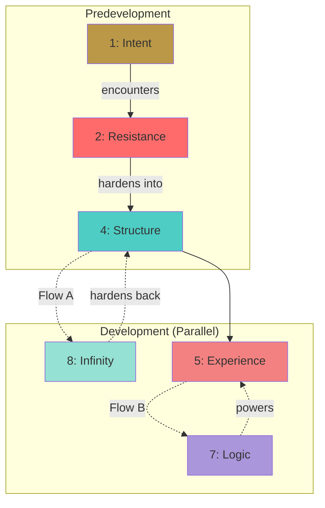

## Directories

ROOT: C:\Users\colli\Downloads#CodeBase#SeedBase
SEEDS: C:\Users\colli\Downloads#CodeBase#SeedBase\SEEDS (Gradient Flows)
FRUIT: C:\Users\colli\Downloads#CodeBase#SeedBase\Fruitful Feedback (READ ONLY)

---

## Purpose

This skill transforms "tasks" into **Flowing Architecture**. It prevents "air castles" (vision without resistance) and "brittle code" (structure without scale testing) by enforcing a **two-phase gradient model**:

1. **Predevelopment:** Sequential gates that transform vision through reality
2. **Development:** Parallel flows that test structure against infinity and connect experience to deep logic

**The River Protocol:**
- Vision (1) flows through Resistance (2) into Structure (4)
- Structure then splits into two parallel streams:
  - **The Scale Stream (4↔8):** Testing against infinity
  - **The Intelligence Stream (5↔7):** Connecting interface to algorithm

**Core Rules:**
1. **Flow, Don't Fight:** Each number transforms the previous, rather than opposing it
2. **Gate-Check Predevelopment:** You must complete 1→2 and 2→4 before coding begins
3. **Parallel Development:** 4↔8 and 5↔7 happen simultaneously during implementation
4. **Breadcrumb Navigation:** Check previous Fruits to see which stream failed, start new Seed strong there

---

## The Gradient Model: Two Phases, Three Pairs

### PHASE 1: PREDEVELOPMENT (Sequential Gates)

#### Gate 1: Intent-to-Resistance (1→2)
**Question:** "What am I trying to build and what's actually in the way?"

| # | Anchor | Definition | Action Required |
|---|---|---|---|
| **1** | **Intent (Source)** | The pure vision. | Define the singular goal without constraints. |
| **2** | **Resistance (Rapids)** | Reality's pushback. | Document actual obstacles: API limits, user habits, technical debt. |

**Output:** A reality-checked intent statement
**Gate Check:** "Have I listed the real obstacles, not just theoretical ones?"

---

#### Gate 2: Resistance-to-Structure (2→4)
**Question:** "How do I architect specifically to absorb these obstacles?"

| # | Anchor | Definition | Action Required |
|---|---|---|---|
| **2** | **Resistance (Rapids)** | From Gate 1. | The obstacles we documented. |
| **4** | **Structure (Channel)** | Architecture designed to handle resistance. | List specific files/patterns that address each obstacle. |

**Output:** A stress-tested architecture plan with file paths
**Gate Check:** "Does each structural decision directly respond to a documented resistance?"

---

### PHASE 2: DEVELOPMENT (Parallel Flows)

#### Flow A: Structure-to-Infinity (4↔8)
**Question:** "Will this architecture survive chaos and scale?"

| # | Anchor | Definition | Action Required |
|---|---|---|---|
| **4** | **Structure (Channel)** | From Gate 2. | The architecture we designed. |
| **8** | **Infinity (Delta)** | Edge cases, scale, chaos. | Test against: 1000x load, missing data, concurrent users, infinite loops. |

**This is bidirectional:** Structure flows to Infinity, Infinity flows back to strengthen Structure
**Flow Check:** "Have I identified where this breaks and hardened those points?"

---

#### Flow B: Experience-to-Logic (5↔7)
**Question:** "How does the user interface hide deep intelligence?"

| # | Anchor | Definition | Action Required |
|---|---|---|---|
| **5** | **Experience (Surface)** | What the user touches. | Define the interface: buttons, charts, latency, error messages. |
| **7** | **Logic (Depth)** | The hidden algorithm beneath. | Document the intelligence: scoring engines, prediction models, data transformations. |

**This is bidirectional:** Experience reveals what Logic needs, Logic determines what Experience can offer
**Flow Check:** "Is the complexity hidden from the user while remaining accessible when needed?"

---

## Behavior

### 1. The "Gradient Check" Protocol (Trigger)
**When the user provides a prompt that implies new features or complexity:**

1. **STOP.** Do not write code immediately.
2. **Assess:** "Does this exist in a current Seed? Or do we need a new flow?"
3. **Propose:** "This sounds like a new Seed [Name]. Shall I run it through the Gradient Gates?"

### 2. Running the Gradients (The Preparation)

**Step 1: Predevelopment Gates (Sequential)**
1. Document Intent (1) → Encounter Resistance (2)
2. Transform Resistance (2) → Design Structure (4)
3. **GATE CHECK:** Does the structure directly address the resistance?
4. **SAVE** Predevelopment section to `SEEDS (Gradient Flows)/[Area] – Seed Log.md`

**Step 2: Development Flows (Parallel)**
5. **Flow A:** Test Structure (4) ↔ Infinity (8)
6. **Flow B:** Connect Experience (5) ↔ Logic (7)
7. **FLOW CHECK:** Are both streams strong?
8. **UPDATE** the Seed Log with both flow results

**Step 3: Visual Architecture**
9. Generate Mermaid flowchart showing the gradient path
10. Mark which stream (A or B) is primary for this Seed

### 3. Cultivating (The Execution)
1. **Active Session Board:** The Seed Log tracks both streams during development
2. **Stream Awareness:** Note which stream you're working on (Scale or Intelligence)
3. **Cross-Pollination:** If a discovery in Flow A affects Flow B, document the connection
4. **Drift Check:** If code drifts from Intent (1), trace back through the gradient

### 4. Harvest (Reviewing Fruit)
1. **Stream Diagnosis:** Which flow failed? 4↔8 (scale issues) or 5↔7 (UX/logic gap)?
2. **Gate Diagnosis:** Did we miss something in 1→2 (bad resistance mapping) or 2→4 (weak structure)?
3. **Breadcrumb Theory:** Use the failure stream to inform where the NEXT Seed starts strong
4. **Document:** Save to Fruit log with stream-specific feedback

---

## Seed Log Format (Gradient Standard)

Save to: `SEEDS (Gradient Flows)/[Area] – Seed Log.md`

```markdown
# [Area] – Seed Log (Gradient)

---

[ID]: [YYYY-MM-DD] – [Intent/Name] ^seed-[short-name]

---

## PREDEVELOPMENT (Sequential Gates)

### Gate 1: Intent → Resistance (1→2)

**1 (Intent / Source):**
[The pure vision - what are we trying to achieve?]

**2 (Resistance / Rapids):**
[The real obstacles - what's actually in the way?]
- Technical: [API limits, data constraints, etc.]
- User: [Habits, expectations, workflows]
- System: [Existing tech debt, coupling, dependencies]

**Reality-Check:**
[One sentence: "We want [Intent] but [Primary Resistance] is the main obstacle"]

---

### Gate 2: Resistance → Structure (2→4)

**2 (Resistance / Rapids):**
[From Gate 1 - the obstacles we documented]

**4 (Structure / Channel):**
[Architecture specifically designed to handle each resistance]
- `path/to/resistance_handler.py` - [Handles: specific obstacle]
- `path/to/adaptation_layer.js` - [Absorbs: specific resistance]
- **Pattern:** [e.g., Event-driven to handle async, Cache layer for API limits]

**Stress-Test:**
[Does each file/pattern directly respond to a documented resistance?]

---

## DEVELOPMENT (Parallel Flows)

### Flow A: Structure ↔ Infinity (4↔8)

**4 (Structure / Channel):**
[From Gate 2 - our architecture]

**8 (Infinity / Delta):**
[Chaos testing - where does this break?]
- **1000x Scale:** [What happens with 1000 simultaneous users?]
- **Edge Cases:** [Missing data, malformed input, null values]
- **Infinite Loops:** [Can any process run forever?]
- **Concurrent Conflicts:** [What if two processes modify the same data?]

**Hardening:**
[How we strengthened the structure based on infinity testing]

**Stream Status:** [PRIMARY / SECONDARY]

---

### Flow B: Experience ↔ Logic (5↔7)

**5 (Experience / Surface):**
[What the user touches]
- **Visual:** [Colors, layout, animations]
- **Performance:** [Latency expectations: < 100ms for X]
- **Feedback:** [Error messages, loading states, success confirmations]
- **Interaction:** [Buttons, gestures, keyboard shortcuts]

**7 (Logic / Depth):**
[The hidden intelligence beneath]
- **Algorithm:** [Scoring engine, prediction model, data transformation]
- **Pattern:** [What hidden logic powers this?]
- **Complexity:** [How is it hidden from the user?]

**Connection:**
[How does the experience reveal the logic without exposing the complexity?]

**Stream Status:** [PRIMARY / SECONDARY]

---

## Architecture Flow (Gradient Visualization)



---

## Prompts & Execution

"[Insert exact User Prompt here]"

"[Next prompt]"

---

## Tasks Completed (Active Log)

### Predevelopment Gates
- [ ] Gate 1 Complete: Intent → Resistance documented
- [ ] Gate 2 Complete: Resistance → Structure mapped

### Development Flows
- [ ] Flow A: Structure ↔ Infinity tested
- [ ] Flow B: Experience ↔ Logic connected

### Implementation
- [ ] [Specific code task]
- [ ] [Specific code task]

---

## Stream Notes

**Primary Stream:** [Flow A (Scale) / Flow B (Intelligence)]
**Cross-Pollination:** [Any discoveries where one flow informed the other]
**Drift Log:** [Any deviations from the gradient path]

---
```

---

## Fruit Log Format (Stream Diagnosis)

Save to: `FRUITFUL FEEDBACK/[Area] – Fruit Log.md`

```markdown
# [Area] – Fruit Log

F: [YYYY-MM-DD] – Seed: [short-name] ^fruit-[short-name]

---

## Stream Diagnosis

**Which Flow Failed?**
- [ ] Flow A (4↔8): Structure couldn't handle scale/chaos
- [ ] Flow B (5↔7): Experience/Logic gap - UX didn't match intelligence

**Which Gate Failed?**
- [ ] Gate 1 (1→2): We missed real resistance, mapped theoretical obstacles
- [ ] Gate 2 (2→4): Structure didn't actually address the resistance

---

## Specific Feedback

**What Broke:**
[Describe the failure]

**Root Cause:**
[Was it Scale, Intelligence, Resistance mapping, or Structure design?]

**Breadcrumb for Next Seed:**
[If Flow A failed, next Seed should start with stronger 4↔8]
[If Flow B failed, next Seed should start with stronger 5↔7]
[If Gate failed, next Seed needs better resistance documentation]

---

## Adjustments

**What Changes:**
[Specific changes to architecture, logic, or approach]

**Status:**
[RESOLVED / IN PROGRESS / NEEDS NEW SEED]

---
```

---

## Example: Torra Trader Seed (Gradient Model)

```markdown
# Torra – Seed Log (Gradient)

[21]: 2025-02-14 – Three-Layer Scoring Engine ^seed-three-layer

## PREDEVELOPMENT

### Gate 1: Intent → Resistance (1→2)

**1 (Intent):**
Make Claude's sentiment scoring deterministic and consistent across algorithm instances

**2 (Resistance):**
- Technical: Claude's API responses vary even with identical prompts
- System: Each algorithm instance has separate database, no shared state
- Pattern: Claude was scoring raw price movements instead of technical indicators

**Reality-Check:**
We want consistent scoring but Claude's variability and our multi-instance architecture fight us

### Gate 2: Resistance → Structure (2→4)

**4 (Structure):**
- `backend/routes/sentiment_routes.py` - Handles: Technical indicators as base layer
- `backend/services/sentiment_engine.py` - Absorbs: Claude's variability with small adjustments
- **Pattern:** Three-layer scoring (Technical base → Claude adjustment → Final score)

---

## DEVELOPMENT

### Flow A: Structure ↔ Infinity (4↔8)

**8 (Infinity):**
- 1000x Scale: Multiple algorithm instances scoring simultaneously
- Edge Cases: Missing technical indicators, API timeout, null sentiment
- Concurrent: Two instances scoring same timestamp

**Hardening:**
Added fallback to technical-only scoring if Claude fails

**Stream Status:** PRIMARY

### Flow B: Experience ↔ Logic (5↔7)

**5 (Experience):**
User sees clean sentiment bars in chart with consistent colors (-100 to +100)

**7 (Logic):**
RSI + MACD + Fibonacci levels feed into Claude who adjusts ±20 points max

**Connection:**
User doesn't see the three-layer split, just sees reliable sentiment

**Stream Status:** SECONDARY
```

---

## Critical Reminders

1. **Gates are Sequential:** You cannot skip from 1 to 4. The resistance MUST transform the structure.
2. **Flows are Parallel:** 4↔8 and 5↔7 inform each other during development.
3. **Breadcrumb Theory:** Failed Flow A? Next Seed starts with stronger infinity testing. Failed Flow B? Start with clearer experience-logic mapping.
4. **Save Before Code:** The Seed Log must exist before code generation begins.
5. **One Primary Stream:** Mark which flow (A or B) is the primary concern for this Seed.

---
